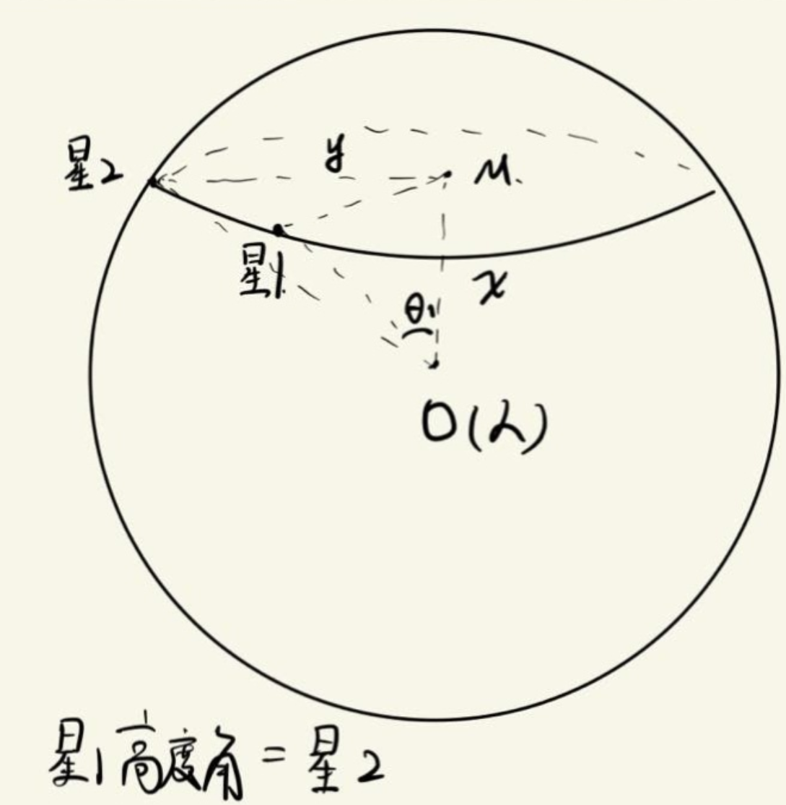
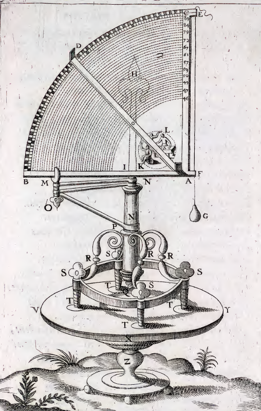
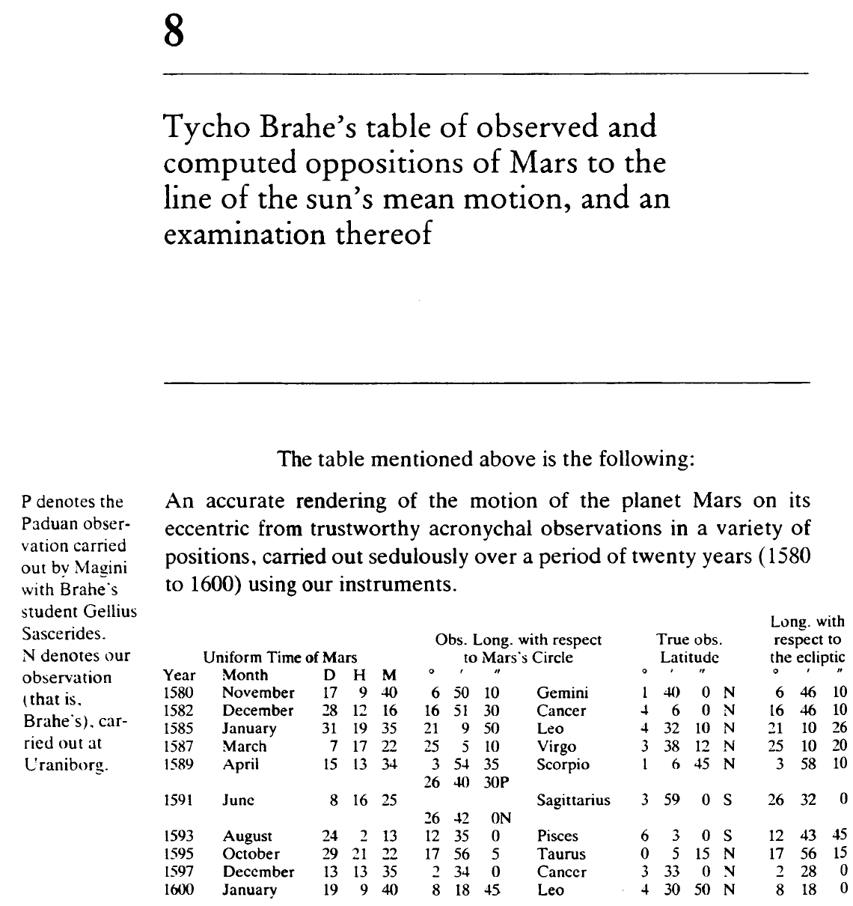

物理课本中天体运动一章的"开普勒三定律"(以下简称"开三")有些没头没尾.在教科书中只给出了开三的解释,却有意无意间忽略了开三诞生的来龙去脉.笔者认为,这对帮助学生理解物理的本质有害无益,于是这一系列的文章便应运而生.

# 1.第谷

第谷非常喜欢看星星.据说在1560年,他在哥本哈根大学看到了被数学家精准预言的日偏食^[1]^.被预言的准确性所震撼的第谷放弃研读哲学,转向了天文学研究.

当然,第谷喜欢上天文学的原因不是本文的重点.我们主要想聊一下他是如何观测各个"天体"^[2]^的位置的.

一个很自然的想法是,第谷可以使用望远镜来观测天体在星空中的位置.很遗憾,望远镜是在1608年第一次被伽利略应用于天文观测上的.由于第谷卒于1601年,因此他不可能使用望远镜观测天体.

那么,第谷就只能用肉眼来观测各个"天体"了.既然使用的是肉眼,那么第谷又是怎么记录各个天体所在的位置的?

已知第谷没有望远镜,只能用"瞪眼法"观察火星.读者不妨亲身试着抬头看一下星空.如果你能看到星星的话(虽然很可能看不到),你会发现,你只能观测到星星相对于你的方位,而无法测量星星与你的距离.也就是说,第谷也无法测量他到天体的距离,只能记录天体相对于他的方位.

那么我们不妨先问问自己: 如果我是第谷,我要用什么方式来记录天体的方位呢?

首先,对于一个天体,我想要知道它"多高".如果天体在我的头顶,那可以说它是"最高"的.如果天体在和我同一水平面上,那可以说它平行于我.如果天体刚好在我的脚底,那它是"最低"的.(虽然我们是看不到在我们水平面下方的天体的)

这样的话我们可以定义所谓的"高度角".让自己的视线方向指向天体,视线方向和水平面的夹角就是高度角.0°代表天体在地平线上,90°代表天体在自己头顶.

以本图为例,使用基础立体几何可知,只要天体1和天体2的在天球的高度相同,那我测量出的"高度角"(也就是看向天体的视线和水平面的夹角)总是相同的.

第谷测量高度角的仪器:

那让我们问自己一个很经典的问题: 在地平线上方的天体高度角是正的,那有没有办法知道在地平线下方的天体的高度角呢?

答案: 仅凭肉眼是无法测出负的高度角的,但我们可以通过数学手段算出来.如何进行计算并不是本文的重点.

很自然地,最北部的地方是高度角90°的地方,最南部的地方是高度角-90°的地方.

一直称呼"最北部的地方"和"最南部的地方"也太麻烦了,天文学家为了简便起见,将高度角90°的地方称为"天顶",将高度角-90°的地方称为"天底".

好了,我们解决了天体的高度问题.当然,高度角相同的天体不代表在同一方位.例如上图中的天体1和天体2,如果定义水平向左为西,水平向右为东,那天体2应当是在正西方向,天体1是在南偏西方向.

只有高度角很明显不足以定位天体所在的位置.

也就是说,我们需要找到"天体在水平面上的投影"所在的方位,也就是下面要讲的第谷测量的方位角.

很自然的想法是,方位角应当只代表天体在水平方向上的投影和水平面上某一根直线的夹角.不妨选定正北方向(或正南方向)为水平面上的那根参考直线,则方位角的大小=天体在水平方向上的投影与原点的连线和正北方向(正南方向)的夹角.

以下以正北方向为水平面上的参考直线.

自然地,当天体在水平方向上的投影处于你的正北方向,那么方位角就是0°.如果处于你的正南方向,方位角就是180°.

因此方位角的大小范围就在0~360°之间,和我们在三角函数里面学的一模一样.

我们把以自己为中心,以无穷大的长度为半径构建的球称为天球.只要能测出天体的高度角和方位角,我们就能把它投影到天球的对应位置上.

让我们回到第谷:

第谷记录天体数据的手法分为四步走^[3]^:

1.控制变量,在固定的观测点观察天体.

2.使用特制仪器测出天体的高度角、方位角.

3.将高度角、方位角转化为天球坐标系的标准参数(黄经和黄纬).

4.记录数据.

关于天球坐标系的标准参数,这个我们留到下篇文章再说.

可以想象到的是,天文学家看了这么多年星星,自然会发现有些星星的高度角和方位角一直不变,有些星星的一直在变化.因此就有了"行星"和"恒星"的叫法区分.

顺带一提,火星之所以被称为"行星",只是因为它在天空中的位置是一直在变化的.而对于一些在天空中不移动的天体(事实上是近似不移动),我们就把它称作"恒星".

简单来说,恒星=看上去不动的天体,行星=看上去运动的天体.当然,看上去不动的天体只是动的慢一些,看上去运动的天体只是动的快一些.在天文学里，我们会把 “动得慢的” 当成 “近似固定”，把 “动得快的” 当成 “变化的”.

至于为什么地球是行星,太阳是恒星,那是受"日心说"的影响,在此不赘述.

就这样,第谷做了近20年的天体运动观测.

不妨以火星为例,看看第谷测量得到的天体数据[Ref,New Astronomy,Kepler,P186]:

在解释本图前,我们需要先解释一下什么是"opposition of Mars".这一英语单词直译过来是"火星的对抗",实际意思是火星冲日.

那我们需要先来解释"火星冲日"的意思.

回到星空中的火星.火星在星空中的亮度自然会随着时间变化,有时亮有时暗.不管何时亮何时暗,有一点是清楚的: 就像灯泡在离人最近的时候最亮,火星在最亮的时候应当离地球最近. 那么什么时候火星离地球最近呢?如果采用日心说,即地球和火星都绕着太阳转,那么只有在太阳、地球、火星在同一条直线上的时候(当然我们不知道是地球在火星和太阳中间,还是火星在地球和太阳中间),火星才会离地球最近.

我们把火星最亮的时刻定义为"火星冲日"的时间点.

好,让我们回到这张表格,做一个详细的解释.本图中只记载了火星冲日时第谷观测到的火星的数据,也是为了计算周期的方便.

以表头数据为例:

1.Uniform Time of Mars: 火星冲日的统一观测时间.

2.Obs.Long. with respect to Mars's Circle: 相对于火星轨道圆的黄经,右侧是对应的星座.

3.True obs. Latitude: 火星的真黄纬.

4.Long. with respect to the ecliptic: 火星相对于椭圆轨道的黄经.

这张表不是第谷记录下的原始数据,而是开普勒换算过后得到的黄经黄玮数据.怎么换算的,下一篇会讲.

# 2.开普勒

这里我们不花大篇幅叙述开普勒是如何遇到第谷并与他相识的,如果有感兴趣的读者可以参考天文学科普书籍《梦游者：西方宇宙观念的变迁》.一句话概括：二人相遇的过程是曲折的,结果是惨淡的.(当然惨淡了,毕竟两人相遇是在1600年,第谷在1601年就死了,绝对惨淡.)

话又说回来,第谷和开普勒也真是互为知己.没有第谷留下的精确测量数据,开普勒不可能推导出他的三大定律.没有开普勒推导出他的三大定律,第谷看了20年的星星,最后也不会在人类历史上留下什么痕迹.

下面我们主要谈谈开普勒是如何基于第谷观测到的数据,推导出火星的周期的.^[Ref]^

还是以上图为例:

既然表格中的内容已经清楚了,我们可以开始计算火星绕日运行的周期了.

一种很容易想到的方法如下:

观察到火星每隔几乎相同的时间会冲日一次,如果把火星和地球绕太阳旋转的轨道当作是圆周运动(事实上,火星和地球绕着太阳转这一事实也要打上一个问号),那么我们可以近似得到火星冲日的周期是$T_{火冲}=771$天.

然后用地球公转周期$T_地=365天$,可算出火星绕太阳公转的周期为$T_火=693天.$

计算方式见^[4]^.

需要说明的是,开普勒一开始使用的是这个方法.但使用这个方法计算火星的周期存在种种疑点,最大的问题是: 如果地球和火星都是绕着太阳作圆周运动,那每次"火星冲日"的间隔应当是一样长的.但通过图中的数据可知,火星冲日的间隔并不一样长.

# 3.参考文献与注释

1: 《梦游者：西方宇宙观念的变迁》,作者:阿瑟·库斯勒.

2: 原谅我不用"行星"这个词汇.事实上,在第谷测量的时候,连"地球绕着太阳转"还是"太阳绕着地球转"都没搞清楚.

怎么能用"行星"这个词来形容"水金木火土"星呢?

3: 1)《New Astronomy》, 作者: Johannes Kepler(约翰$\cdot$开普勒). 

​    2)《TychonisBraheAs00BrahA》，作者：TychonisBrahe(第谷$\cdot$布拉赫).

4: 假设火星和地球都绕着太阳作匀速圆周运动,已知$T_{火冲}与T_地$,则有:
$$
\omega_{地}T_{火冲}-\omega_{火}T_{火冲}=2\pi,\\
\omega_{地}=\dfrac{2\pi}{T_地},\\
\omega_{火}=\dfrac{2\pi}{T_火},\\
因此\dfrac{1}{T_地}-\dfrac{1}{T_火}=\dfrac{1}{T_{火冲}}
$$
计算可得$T_{火}$=693天.

