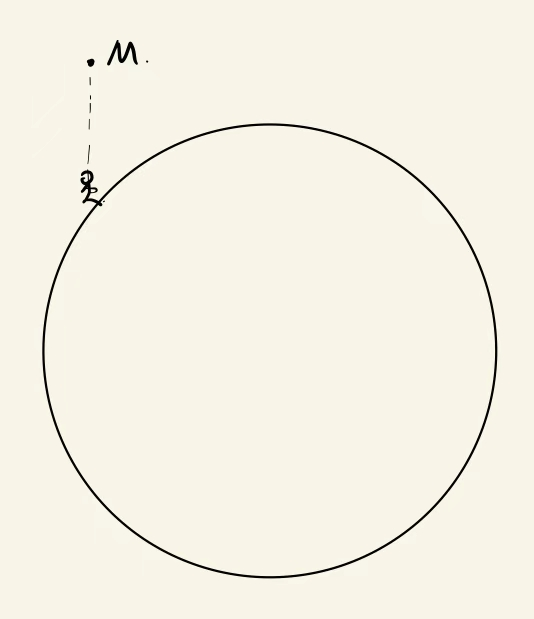
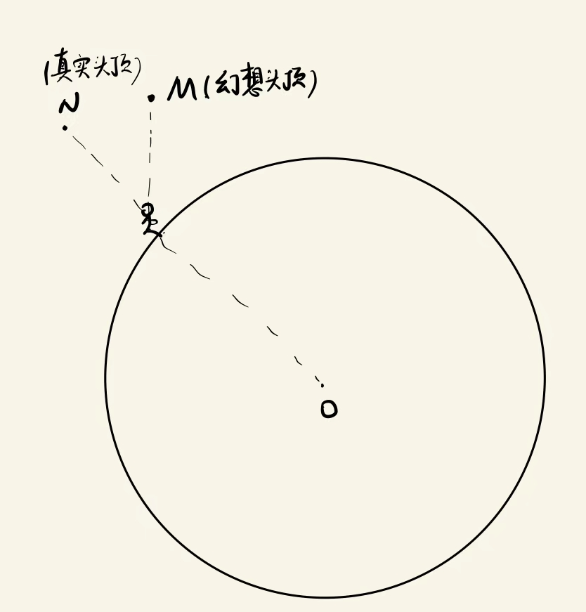
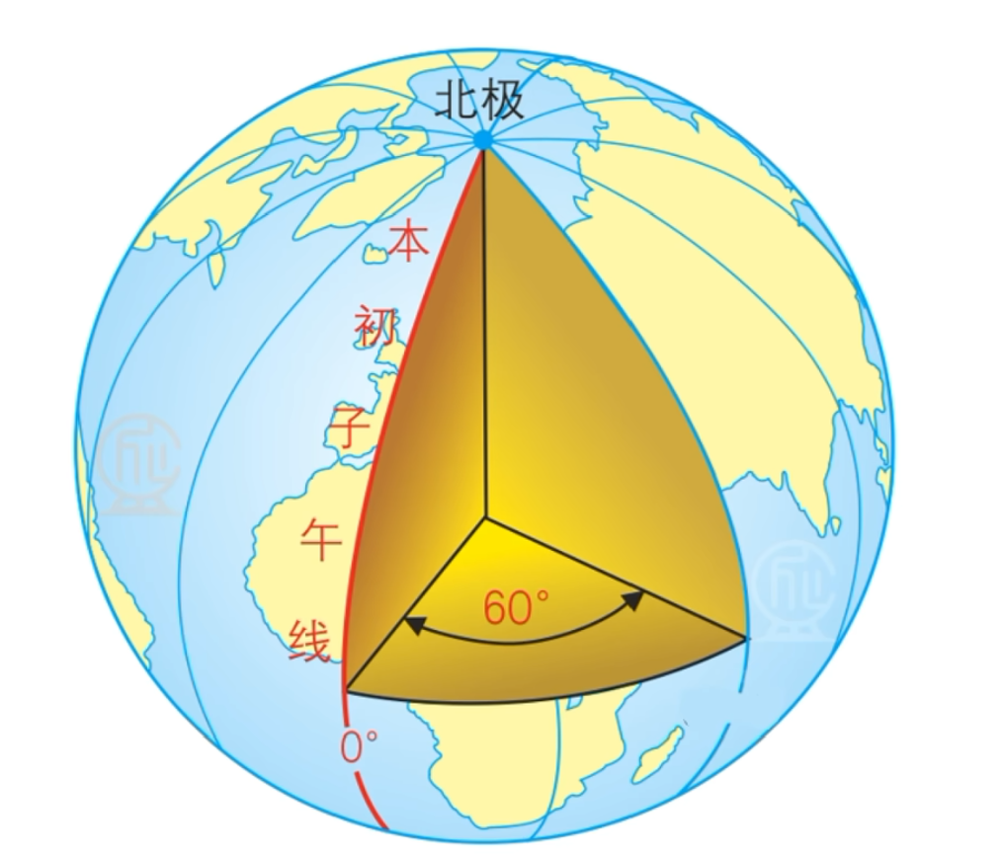

回顾上一期的内容: 我们已经知道了第谷测量出了天体的高度角和方位角,并且把这些数据交给了开普勒.

而开普勒依据火星冲日的周期性,得到了火星绕着太阳公转的周期.

(当然,所谓火星和地球都绕着太阳做圆周运动依然是我们的假设,我们知道地球和火星都绕着太阳做一定周期的公转,但是不是圆周运动不得而知.)

经整理后,上一期中第谷的表格:

| Year | Month    | D    | H M   | Mars' Circle Longitude(圆轨道黄经) |      |      | Sign        | Latitude(黄玮) |      |      | Direction | Ecliptic Longitude(椭圆轨道黄经) |      |      |
| ---- | -------- | ---- | ----- | ---------------------------------- | ---- | ---- | ----------- | -------------- | ---- | ---- | --------- | -------------------------------- | ---- | ---- |
|      |          |      |       | °                                  | '    | "    |             | °              | '    | "    |           | °                                | '    | "    |
| 1580 | November | 17   | 9 40  | 6                                  | 50   | 10   | Gemini      | 1              | 40   | 0    | N         | 6                                | 46   | 10   |
| 1582 | December | 28   | 12 16 | 16                                 | 51   | 30   | Cancer      | 4              | 6    | 0    | N         | 16                               | 46   | 10   |
| 1585 | January  | 31   | 19 35 | 21                                 | 9    | 50   | Leo         | 4              | 32   | 10   | N         | 21                               | 10   | 26   |
| 1587 | March    | 7    | 17 22 | 25                                 | 5    | 10   | Virgo       | 3              | 38   | 12   | N         | 25                               | 10   | 20   |
| 1589 | April    | 15   | 13 34 | 3                                  | 54   | 35   | Scorpio     | 1              | 6    | 45   | N         | 3                                | 58   | 10   |
| 1591 | June     | 8    | 16 25 | 26                                 | 40   | 30   | Sagittarius | 3              | 59   | 0    | S         | 26                               | 32   | 0    |
| 1593 | August   | 24   | 2 13  | 12                                 | 35   | 0    | Pisces      | 6              | 3    | 0    | S         | 12                               | 43   | 45   |
| 1595 | October  | 29   | 21 22 | 17                                 | 56   | 5    | Taurus      | 0              | 5    | 15   | N         | 17                               | 56   | 15   |
| 1597 | December | 13   | 13 35 | 28                                 | 34   | 0    | Cancer      | 3              | 33   | 0    | N         | 28                               | 18   | 0    |
| 1600 | January  | 19   | 9 40  | 8                                  | 18   | 45   | Leo         | 4              | 30   | 50   | N         | 8                                | 2    | 0    |

观察表中数据,好像并没有所谓高度角与方位角?取而代之的是黄经和黄玮.这是为什么呢?

聪明的读者应该想到,高度角和方位角有它自己的问题: 在地球上不同地点,观测到的同一位置天体的高度角和方位角显然不同.

那么有没有办法获得一个天体的绝对坐标呢?即不管我在哪里观测,都能把我观测到的方位角和高度角转换成天体在某个固定坐标系下的位置,就像平面直角坐标系里,我在点(x,y)观测点(z,w)时得到的向量是(z-x,w-y).但如果定死一个点为原点,点(z,w)的绝对坐标不会因为观测者的坐标变化而变化,永远是(z,w).

你应该想到了: 有办法!如果我们以自己为中心建立天球,那天体相对于我们的坐标肯定是和我们有关的,这不行.

但如果我们以地球为中心建立天球呢? 事实上,这就是第谷所为.他以地球为中心建立天球,这样所有天体的坐标不会因为观测者的位置改变而改变.这就是所谓的"赤道坐标系."

那么问题又来了: 我知道自己的纬度,我知道天体此时此刻的高度角和方位角,我可以用什么坐标来表示天体的绝对位置?

先来解决这个问题: 对于我们来说,在头顶的天体到底在哪里?对于我们来说,地平面又究竟在哪里?

一个很自然的想法是:

我们的头顶应该在点M?

不,事实上,我们的头顶应该在点N:

因为我们以为的头顶,肯定是重力方向的反方向,而重力方向又是指向地心的,所以真实的头顶一定在我们和地心连线所构成的直线上.

同理,我们认为的地平面其实是过我们自己的,和我们与地心连线垂直的那个平面,那就是地平面.

好,那么在赤道坐标系下的天体方位,我们就把它称作赤经和赤纬.先别急着研究黄经和黄玮,让我们先研究下什么是赤经和赤纬.！

事实上,开普勒是先把高度角和方位角转化成赤经和赤纬.在介绍赤经和赤纬之前,让我们先问一下自己: 地球上的经度和纬度是如何定义的?

纬度为0°的物体在赤道上,纬度为90°的物体在北极/南极上.一个物体的纬度和高度角的测量过程是完全类似的.

经度呢?

经度实质上是二面角.图中的大圆和本初子午线所在的大圆夹角是60°,因此它就是东经60°.

回顾了经度和纬度的概念,接下来让我们学习赤经和赤纬:

所谓赤经和赤纬,都是相对以地球中心为球心,赤道面作为天球基准面构建的天球而言的.

先来了解赤纬.其定义思路和纬度完全一致,一个在赤道面平面上的天体,赤纬就是0°.一个在天球北部顶端的天体,赤纬就是90°N.一个在天球南部底端的天体,赤纬就是90°S.(我们把天球北部顶端称为北天极、南部底端称为南天极)

好,我们接着谈赤经:

赤经就是天体在天球上的经度

在计算地球上的经度时,需要一条基准线作为0°经度线,我们都知道它就是本初子午线,也就是经过北极、南极和格林尼治天文台的这个大圆.

那对于天球上的0°经线,北天极和南天极是容易找的,我们要再找哪一点呢?

|    对比维度     |                      地球的经度 / 纬度                       |                  天球的赤经（α）/ 赤纬（δ）                  |
| :-------------: | :----------------------------------------------------------: | :----------------------------------------------------------: |
|    适用对象     |                    地球上的点（地理坐标）                    |                   天球上的天体（天文坐标）                   |
| 基准面 / 基准圈 |      纬度：赤道平面（0°）；经度：本初子午面（0° 经线）       | 赤纬：天赤道平面（0°，地球赤道延伸）；赤经：春分点（0h，天赤道上的固定起点） |
| 度量方向 / 范围 | 纬度：南北向（-90°~+90°，南纬 / 北纬）；经度：东西向（0°~180°，东经 / 西经） | 赤纬：南北向（-90°~+90°，南赤纬 / 北赤纬）；赤经：东向（0h~24h，1h=15°，无东西之分） |
|    核心关联     |     天球赤道 = 地球赤道延伸；天球南北极 = 地球南北极延伸     |    本质是 “地球坐标在天球上的投影扩展”，用于描述天体位置     |

我们不妨来对赤经和赤纬做一下转换:

已知高度角、方位角、观测时间与观测地点，如何计算天体此时的赤经和赤纬?

预警: 接下来是比较艰深的数学部分,如果对数学敏感的朋友可以直接移步下一篇文章.

已知条件:

- 观测地纬度：$\phi$（北正，南负）
- 天体高度角：h（0° = 地平，90° = 天顶）
- 天体方位角：A（从北顺时针量，0° = 北，90° = 东）
- 地方恒星时：LST（小时，可转成角度：1h = 15°）

要求：

- 赤纬 $\delta$
- 时角 H
- 赤经 $\alpha$

好,我们做一个简单的复习:

这一节,我们学习了赤经、赤纬的定义,以及如何把高度角、方位角、测量时间、测量地点转换为赤经和赤纬.

让我们下次解决黄经和黄玮的问题,并一并推理出: 地球/火星是绕着太阳在做椭圆运动的!

