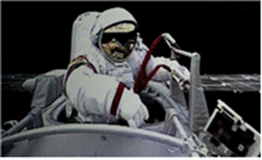
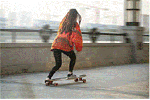

**研究物理对象: 搞明白定义、实例、习题,立于不败之地.**(事实上,如果实例完全理解的话,也可以不需要定义.)

有没有办法自己尝试着描述一下它?如果可以的话,不需要做题也能证明自己理解了它.

#### 1.质点

为什么要引入质点? 为了研究具体问题的方便.

定义: 对于研究具体问题而言,体积和形状可以忽略不计的物体叫做质点.

实例: 

A.地球绕着太阳公转(地球很小,太阳很大,地球的体积和形状可以忽略不计)；

B.做物理题时滑块从斜面上滑下(滑块滑下时,其体积和形状对研究其运动模式没有影响)；

C.我从上海走到北京(我很小,上海到北京很远,我的体积和形状可以忽略不计)。

习题:

1)下列关于质点的说法中正确的是（　　）

A.质量很小的物体都能视为质点    

B.体积很小的物体都能视为质点 

C.研究地球的公转时可将地球视为质点  

D.在转动的物体一定不能被视为质点

2)2024年5月28日，历时约8.5小时，神舟十八号载人飞船的航天员刷新了中国航天员单次出舱活动时间纪录，完成了空间站空间碎片防护装置安装、舱外设备巡检等任务。下列说法正确的是（　　）

A．执行载人飞船与核心舱交会对接时，可将载人飞船看作质点  

B．研究宇航员出舱太空行走的姿态，可将宇航员看作质点  

C．操作机械臂旋转的工作过程，可将机械臂看作质点  

D．研究载人飞船绕地球一圈的时间，可将载人飞船看作质点

#### 2.参考系(参照系)

定义: 参考系是物体运动时参照的对象,仅此而已.

实例: 

A.人在地球上静止不动.

以地球为参考系,则人是不动的.

以月亮为参考系,则人是移动的.

B.人坐在车里,静止不动,车子在马路上笔直向前开.

以车为参考系,则人是不动的.

以马路为参考系,则人是在不断移动的.

习题:

1)下列关于参照系的说法中，正确的是（　　）

A．被选做参照系的物体一定是相对地面静止的    

B．选不同的参照系时对同一物体的描述是相同的  

C．描述同一物体的运动时可以取不同物体做参照系 

D．描述不同物体的运动不能用同一物体做参照系

2)如图是体育摄影中“追拍法”的成功之作，摄影师眼中清晰的滑板运动员是静止的，而模糊的背景是运动的，摄影师用自己的方式表达了运动的美。请问摄影师选择的参考系是（　　）

A．大地                                  B．太阳   

C．滑板运动员                            D．静止的人

#### 3.坐标系与位置

实例: 笛卡尔坐标系.

习题:

#### 4.矢量与标量

定义: 矢量=向量.

实例: 不用讲.

习题:

#### 5.描述运动的物理量: 时刻与时间

定义: 时刻: 一个具体的点. 时间: 一段具体的时间.

实例: 画图.英语单词: at和until.

习题:

#### 6.位移与路程

定义: 位移: 矢量. 表示物体从开始运动到停止运动的矢量. 路程: 物体经过的距离.

实例: 画图. 如学生绕着400m跑道跑一圈，位移为0，路程为400m。

习题:

#### 7.速度与速率

定义?

这是翻译的锅!却要赖到学生头上.

关于速度和速率吐槽的部分:

中文里面,我们经常把"速率"和"速度"搞混,是因为当时在翻译的时候就有问题.

英文中作了很明确的区分.

他们的日常口语中的"速率"是speed.

而速度是"velocity",也就是"v".

定义: 速度: 矢量.  位移/时间.

速率: 该时刻通过的路程/时间.

实例: 画图.

平均速度: 位移大小/时间.

平均速率: 路程大小/时间.

瞬时速度和瞬时速            

速度变化量                                                                                                                                                                                                                              

习题:

向量的加减法

速度的变化量: Δv=v末-v初,多出点题. 

#### 8.矢量和标量之间能做的事