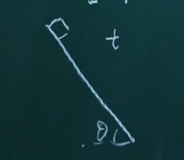

研究运动三套系统:

A.力与加速度(牛顿运动定律与匀、变速直线运动)

B.机械能守恒

C.动量、冲量守恒.

动量、冲量是第三套系统.

1.动量

p=mv

注意与动能相区分.

$E_k=\frac{1}{2}mv^2$

区分1: 动能是标量,动量是矢量.

如何计算动量的改变量:
$$
\Delta p=p_末-p_初
$$

例子1: 小球撞墙. 飞过来的时候: 3m/s. 飞回去: 2m/s.

例子2: 球作匀速圆周运动.

例子3.

2.冲量: 表示力在时间上的累积.

区分: 冲量和功.

冲量: 力在时间上的积累.

功: 力在空间上的积累.

I=F*t.

例1.

例2.求重力与支持力的冲量

例3.例2更进一步:

3.动量定理:

合外力冲量=动量的变化量

证明: 使用牛顿第二定律

更进一步的结论: 如果一个系统在相互作用时，外力的矢量和为0，则系统动量守恒.

该结论被称为动量守恒定理.

在某个方向上,这件事也是没问题的.

例题5.大小木板

延申: 为什么内力对于系统不产生动量的变化量?

当然,摩擦力做功,所以机械能不守恒.

机械能守恒判定标准:

动量守恒判定标准: 合外力=0,或者合外力*t=0

例题4. 蹦极绳与冲量

小部分总结:

例题3.

4.动量守恒与机械能守恒辨析

**动量守恒判定标准: 合外力冲量=0.**

**机械能守恒: 除了重力和弹力以外,其他力做功为0.(就看摩擦力)**

事实上弹力永远不会做功.

例题1.动量守恒? 机械能守恒?

墙壁的弹力没有做功哦.