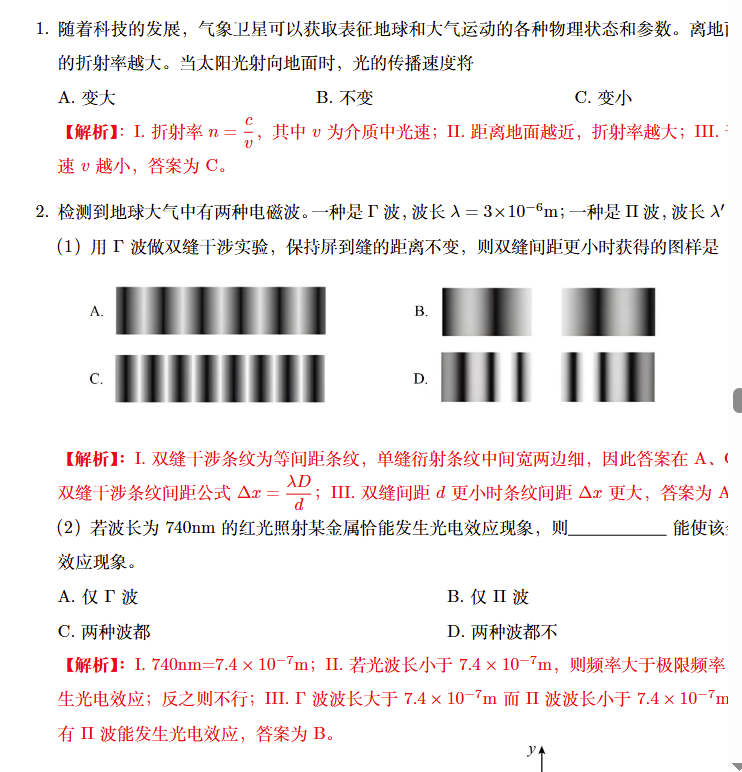

```
\section*{} % 创建无标题的节（保留格式间距）
\addcontentsline{toc}{section}{25年浦东二模解析}
\begin{center}
    \Large
   \textbf{2025年浦东新区二模物理}
\end{center}
\begin{enumerate}
\begin{center}
     \subsection*{一、大气探测}
\end{center}
\item 随着科技的发展，气象卫星可以获取表征地球和大气运动的各种物理状态和参数。离地面越近，大气的折射率越大。当太阳光射向地面时，光的传播速度将\\
\begin{minipage}{0.33\linewidth}
   A. 变大 
\end{minipage}
\begin{minipage}{0.33\linewidth}
   B. 不变
\end{minipage}
\begin{minipage}{0.33\linewidth}
  C. 变小
\end{minipage}\\
\textcolor{red}{\textbf{【解析】}：I. 折射率$n=\dfrac{c}{v}$，其中$v$为介质中光速；II. 距离地面越近，折射率越大；III. 于是介质中光速$v$越小，答案为C。}
\item 检测到地球大气中有两种电磁波。一种是$\Gamma$波，波长$\lambda=3\times 10^{-6}$m；一种是$\Pi$波，波长$\lambda'=1\times 10^{-7}$m。\\
（1）用$\Gamma$波做双缝干涉实验，保持屏到缝的距离不变，则双缝间距更小时获得的图样是
\begin{figure}[h]
\hspace{1cm}
    \includegraphics[width=0.75\linewidth]{yzs.png}
\end{figure}\\
\textcolor{red}{\textbf{【解析】：}I. 双缝干涉条纹为等间距条纹，单缝衍射条纹中间宽两边细，因此答案在A、C中选择；II. 双缝干涉条纹间距公式$\Delta x=\dfrac{\lambda D}{d}$；III. 双缝间距$d$更小时条纹间距$\Delta x$更大，答案为A。}\\
（2）若波长为740nm的红光照射某金属恰能发生光电效应现象，则\underline{\hspace{2cm}}能使该金属发生光电效应现象。\\
\begin{minipage}{0.5\linewidth}
    A. 仅$\Gamma$波
\end{minipage}
\begin{minipage}{0.5\linewidth}
    B. 仅$\Pi$波
\end{minipage}\\
\begin{minipage}{0.5\linewidth}
    C. 两种波都
\end{minipage}
\begin{minipage}{0.5\linewidth}
    D. 两种波都不
\end{minipage}\\
\textcolor{red}{\textbf{【解析】：}I. 740nm=$7.4\times 10^{-7}$m；II. 若光波长小于$7.4\times 10^{-7}$m，则频率大于极限频率，从而能够发生光电效应；反之则不行；III. $\Gamma$波波长大于$7.4\times 10^{-7}$m而$\Pi$波波长小于$7.4\times 10^{-7}$m；IV. 因此只有$\Pi$波能发生光电效应，答案为B。}\\
\begin{minipage}{0.6\linewidth}
    （3）真空中光速$c=3\times 10^8$m/s，则$\Gamma$波的传播周期为\underline{\hspace{2cm}}s。真空中捕捉到$\Gamma$波部分波形如图所示，则波在$A$、$B$两点之间传播需要\underline{\hspace{2cm}}s。
\end{minipage}
\begin{minipage}{0.4\linewidth}
    \includegraphics[width=\linewidth]{浦东.png}
\end{minipage}\\
\textcolor{red}{\textbf{【解析】：}I. 波的周期$T=\dfrac{\lambda}{c}=1.0\times 10^{-14}$s；II. 由图可知波长$\lambda$对应四个格子宽，而$AB$间距为三个格子，因此$d_{AB}=\dfrac{3}{4}\lambda$；III. 在$AB$间传播需要时间$t=\dfrac{d_{AB}}{c}=\dfrac{3}{4}T=7.5\times 10^{-15}$s。}\\
\begin{minipage}{0.73\linewidth}
  \item   如图所示的两种气象卫星，一种是经过两极附近的极轨卫星，离地高度约为850 km；一种是在赤道平面上运行的同步卫星，离地高度约为35800 km。关于两卫星的公转线速度$v$、公转周期$T$的关系正确的是
\end{minipage}
\hfill
\begin{minipage}{0.25\linewidth}
    \includegraphics[height=3\baselineskip]{tup.png}
\end{minipage}\\[5pt]
\begin{minipage}{0.5\linewidth}
    A. $v_\text{甲}>v_\text{乙}$
\end{minipage}
\begin{minipage}{0.5\linewidth}
    B. $v_\text{甲}<v_\text{乙}$
\end{minipage}\\
\begin{minipage}{0.5\linewidth}
    C. $T_\text{甲}>T_\text{乙}$
\end{minipage}
\begin{minipage}{0.5\linewidth}
    D. $T_\text{甲}<T_\text{乙}$
\end{minipage}\\
\textcolor{red}{\textbf{【解析】：}I. 由于卫星绕着地球做圆周运动，因此做圆周运动半径越大，公转线速度越小，公转周期越大；II. 因此$v_\text{甲}>v_\text{乙}$，$T_\text{甲}<T_\text{乙}$，答案为AD。}
\begin{center}
    \subsection*{二、输液}
\end{center}
\begin{minipage}{0.7\linewidth} 
{\kaishu 输液时可用一种电容式输液传感器夹在滴壶下的输液管上，它可以自动检测输液管中药液的有无，如图所示。}

 \item 滴壶中的药液面呈“凹液面”，这是液体的\underline{\hspace{2cm}}现象。
\end{minipage}
\hfill
\begin{minipage}{0.25\linewidth}
    \includegraphics[height=4\baselineskip]{图片1.png}
\end{minipage}\\
\begin{minipage}{0.5\linewidth}
A. 浸润
\end{minipage}
\begin{minipage}{0.5\linewidth}
B. 不浸润
\end{minipage}\\
\textcolor{red}{\textbf{【解析】：}凹液面为浸润现象，答案为A。}
 \item 在药液减少的过程中，输液瓶对输液架的作用力为$F_1$，输液架对地面的作用力为$F_2$，地面对输液架的作用力为$F_3$，则作用力大小关系始终成立的是\underline{\hspace{2cm}}。\\
\begin{minipage}{0.2\linewidth}
A. $F_1=F_2$
\end{minipage}
\begin{minipage}{0.2\linewidth}
B. $F_1>F_2$
\end{minipage}
\begin{minipage}{0.2\linewidth}
C. $F_2=F_3$
\end{minipage}
\begin{minipage}{0.2\linewidth}
D. $F_2<F_3$
\end{minipage}
\begin{minipage}{0.2\linewidth}
E. $F_1=F_3$
\end{minipage}\\
\textcolor{red}{\textbf{【解析】：}I. 地面对输液架的力$F_3$和输液架对地面的力$F_2$是一对作用力与反作用力，因此大小必定相等；II. 输液瓶对输液架的作用力$F_1$大小约等于输液瓶重力，地面对输液架作用力$F_3$则约等于输液瓶重力加上输液架重力，因此大于$F_1$；III. 因此$F_3=F_2>F_1$，答案为C。}
\item 输液过程中，空气从空心管进入瓶中形成小气泡并逐渐上升。假设瓶内温度保持不变。\\
（1）小气泡在上升过程中，其符合的$p-V$图是\underline{\hspace{2cm}}。
\begin{figure}[h]
    \centering
    \includegraphics[width=0.9\linewidth]{截屏2025-06-19 11.56.57.png}
\end{figure} \\
\textcolor{red}{\textbf{【解析】；}I. 由于温度不变，因此气泡内气体$pV$为一常数，答案在C、D中选择；II. 上升过程中压强减小，体积增大，因此答案为C。}\\
 （2）在小气泡上升的过程中，\underline{\hspace{1cm}}。
 \\
 \begin{minipage}{0.5\linewidth}
 A. 外界对气泡做功，气泡放热 
 \end{minipage}
 \begin{minipage}{0.5\linewidth}
 B. 气泡对外界做功，同时放热
\end{minipage}
 \begin{minipage}{0.5\linewidth}
 C. 外界对气泡做功，气泡吸热  
 \end{minipage}
 \begin{minipage}{0.5\linewidth}
 D. 气泡对外界做功，同时吸热 
 \end{minipage}\\[10pt]
 \textcolor{red}{\textbf{【解析】：}I. 上升过程中小气泡体积增大，因此气泡对外界做功；II. 根据热力学第一定律$\Delta U=Q+W$。
 \begin{enumerate}
     \item 气体经历等温过程，因此温度不变，内能不变，故$\Delta U=0$
     \item 气体体积增大，因此外界对气体做负功，$W<0$
     \item 因此$Q=-W>0$，气泡吸热。答案为D。
 \end{enumerate}
 }
 \begin{minipage}{0.5\linewidth} 
 \item 输液传感器内部的测量电路如图（a）所示。A、B间电压恒为$U_0$，$R$为定值电阻，可控开关S不断在1、2之间自动切换。随着系统监测每次充电过程中电路中的电流随时间的变化曲线可自动判断是否有药液。有药液时，输液传感器的电容值大。图（b）
\end{minipage}
\begin{minipage}{0.5\linewidth}
   \includegraphics[height=5\baselineskip]{截屏2025-06-19 12.09.50.png}
\end{minipage}\\[5pt]
为甲、乙两次监测的结果。
\\
（1）两次监测结果中，没有药液的是\underline{\hspace{2cm}}。
\\
\begin{minipage}{0.5\linewidth}
A. 甲
\end{minipage}
\begin{minipage}{0.5\linewidth}
B. 乙
\end{minipage}
\\
\textcolor{red}{\textbf{【解析】：}I. $I-t$图围成面积表示充电过程中充入电容器的电荷量$q$；II. 因此最终充入乙的电荷量$Q_\text{乙}>Q_\text{甲}$；III. 而充电电荷量$Q=CU_0$，因此$C_\text{乙}>C_\text{甲}$，从而甲没有药液，答案为A。}\\
（2）在$0\sim t_1$时间内，两次监测下电容器C两端的电压变化量分别为$\Delta U_\text{甲}$和$\Delta U_\text{乙}$，则\underline{\hspace{2cm}}。
\\
\begin{minipage}{0.33\linewidth}
A. $|\Delta U_\text{甲}|=|\Delta U_\text{乙}|$
\end{minipage}
\begin{minipage}{0.33\linewidth}
B. $|\Delta U_\text{甲}|>|\Delta U_\text{乙}|$
\end{minipage}
\begin{minipage}{0.33\linewidth}
C. $|\Delta U_\text{甲}|<|\Delta U_\text{乙}|$    
\end{minipage}\\
\textcolor{red}{\textbf{【解析】：}I. 根据欧姆定律，当电容器两端电压为$U_C$时，充电电流$I=\dfrac{U_0-U_C}{R}$；II. 由于$t_1$时刻$I_\text{甲}<I_{\text{乙}}$，因此$U_{C\text{甲}}>U_{C\text{乙}}$；III. 由于初始状态下电容器两端电压为$0$，因此电压变化量就是$t_1$时刻甲乙两端电压，即$\Delta U_{\text{甲}}=U_{C\text{甲}}$，$\Delta U_{\text{乙}}=U_{C\text{乙}}$；IV. 故$\Delta U_{\text{甲}}>\Delta U_{\text{乙}}$，答案为B。}
\begin{center}
     \subsection*{三、算盘}
\end{center}

\begin{minipage}{0.48\linewidth}
{\kaishu 算盘是中国古代一直延用至今的计数工具，它由若干根杆和算珠组成。如图所示，桌面上水平放置一个算盘。算珠可穿在固定的杆上滑动，算珠与杆之间的动摩擦因数为0.1。发现某一根杆上有A、B两颗算珠未在归零位。现将算珠A拨出，离}
\end{minipage}
\hfill
\begin{minipage}{0.5\linewidth}
    \includegraphics[height=5\baselineskip]{截屏2025-06-19 13.07.25.png}
\end{minipage}\\[3pt]
{\kaishu 手时$v_{A_0}=$0.4 m/s，A、B相隔$s_1=3.5$ cm，B与上边框相隔$s_2=2$cm。每颗算珠质量为10g，重力加速度$g$取10 m/s$^2$。}
\item A被拨出后在碰到B之前，其加速度大小$a$＝\underline{\hspace{2cm}} m/s$^2$。\\
\textcolor{red}{\textbf{【解析】：}根据牛顿第二定律$a=\mu g=1\text{m/s}^2$}
\item A、B在碰撞前后的$v-t$图像如图所示。（A、B碰撞的时间极短）
\\
（1）（计算）求碰撞过程中A受到的合外力冲量。\\
（2）（简答）通过计算、分析，说明A与B的碰撞是否为完全弹性碰撞。\\[10pt]
\begin{minipage}{0.45\linewidth}
\textcolor{red}{\textbf{【解析】：}（1）碰撞前$A$物体速度$v_{A1}=0.3$m/s，碰撞后$A$物体速度$v_{A2}=0.1$m/s。根据动量定理：$I=mv_{A1}-mv_{A2}=2\times 10^{-3}\text{N}\cdot\text{s}$，方向向下。\\
（2）根据定义，如果两物体碰撞前后机械能不}
\end{minipage}
\begin{minipage}{0.5\linewidth}
     \includegraphics[width=\linewidth]{截屏2025-06-19 13.21.50.png}
\end{minipage}\\[10pt]
\textcolor{red}{
变，则两物体发生完全弹性碰撞。因此我们计算碰撞前后A、B的动能。
\begin{enumerate}[label=\Roman*.]
    \item 碰撞前A速度为$v_{A1}=0.3$m/s，$B$速度为$0$，因此碰撞前总机械能为
    $$E_1=\dfrac{1}{2}mv_{A1}^2$$
    \item 碰撞后A速度为$v_{A2}=0.1$m/s，B速度为$v_B=0.2$m/s，因此碰撞后总机械能为
    $$E_2=\dfrac{1}{2}mv_{A2}^2+\dfrac{1}{2}mv_B^2$$
    \item 代入数据求得$E_1<E_2$，因此两物体的碰撞不是完全弹性碰撞。
    \end{enumerate}}
（3）若要使A、B都回到自己的归零位，在拨出A时需要对A做的功为\underline{\hspace{2cm}}。\\
\begin{minipage}{0.5\linewidth}
    A.等于2×10$^{-4}$J
\end{minipage}
\begin{minipage}{0.5\linewidth}
    B.介于2×10$^{-4}$J与7.5×10$^{-4}$J之间
\end{minipage}
\begin{minipage}{0.5\linewidth}
    C.等于7.5×10$^{-4}$J 
\end{minipage}
\begin{minipage}{0.5\linewidth}
    D.大于7.5×10$^{-4}$J
\end{minipage}
{\textcolor{red}{\textbf{【解析】：}I. A要回到归零位至少需要克服摩擦力做功$W_A=\mu mg(s_1+s_2)$，B至少要克服摩擦力做功$W_B=\mu mg s_2$；II. 代入数据计算可得$W_A+W_B=7.5\times 10^{-4}$J；III. 由于A、B间碰撞还需损耗能量，因此拨出A时对A做功必须大于$7.5\times 10^{-4}$J，答案为D。}
\newpage
\begin{center}
     \subsection*{四、电子的发现}
\end{center}
\begin{figure}[h]
    \centering
    \includegraphics[width=0.5\linewidth]{图片2.png}
\end{figure}
\item 对于图中的阴极K和阳极A（阴极K相对于阳极A很小）。
\\
（1）K、A两极之间的电场线与等差等势面分布正确的是\underline{\hspace{2cm}}。
\\
\begin{minipage}{0.5\linewidth}
        \includegraphics[width=1\linewidth]{hungry.png}     
\end{minipage}
\begin{minipage}{0.5\linewidth}
              \includegraphics[width=1\linewidth]{angry.png}
\end{minipage}
\\
\textcolor{red}{\textbf{【解析】：}I. 电场线方向由正电荷指向负电荷，因此答案在C、D中选择；II. 靠近K处电场线更密集，因此电场强度更大；III. 故靠近K处等势面更密集，答案为C。}\\
（2）一个带负电粒子从阴极K开始仅受电场力的作用由静止运动到阳极A。若粒子在电场中的动能为$E_k$，电势能为$E_p$，则\underline{\hspace{2cm}}。
\\
\begin{minipage}{0.5\linewidth}
A. $E_k$一直变大；$E_p$一直变大   
\end{minipage}
\begin{minipage}{0.5\linewidth}
B. $E_k$一直变大；$E_k$一直变小 
\end{minipage}
\begin{minipage}{0.5\linewidth}
C. $E_k$一直变小；$E_k$一直变大        
\end{minipage}
\begin{minipage}{0.5\linewidth}
D. $E_k$一直变小；$E_k$一直变小  
\end{minipage}\\
\textcolor{red}{\textbf{【解析】：}I. 电场线方向向左，由于粒子带负电，因此受电场力方向向右；II. 粒子由K运动到A，因此运动方向也向右；III. 电场力做正功，因此电势能减小而动能增大，答案为B。}
\item 在管外于C、D极板前后装有一对平行载流线圈，电流方向如图所示:
\\
（1）这对载流线圈产生的磁场方向为\underline{\hspace{2cm}}。
\\
\begin{minipage}{0.5\linewidth}
    \includegraphics[width=0.7\linewidth]{截屏2025-06-19 23.54.38.png}
\end{minipage}
\begin{minipage}{0.5\linewidth}
    \includegraphics[width=0.7\linewidth]{2222.png}
\end{minipage}
\\
\textcolor{red}{\textbf{【解析】：}根据右手螺旋定则，四指绕向和电流方向一致，大拇指方向为磁感应强度方向，答案为B。}\\
（2）线圈产生一个与C、D间匀强电场及粒子束运动方向均垂直的匀强磁场。调节载流线圈中的电流，可使粒子匀速通过C、D并射至荧光屏上O处。测得  C、D两板间的电势差为$U$，间距为$d$，磁感应强度为B。通过以上物理量可求得粒子速度$v$＝\underline{\hspace{2cm}}。\\
\textcolor{red}{\textbf{【解析】：}本题考察速度选择器原理。I. 粒子能够匀速通过C、D，因此电场力和洛伦兹力彼此平衡$qE=qvB$；II. 电场强度$E=\dfrac{U}{d}$；III. 解得粒子速度$v=\dfrac{E}{B}=\dfrac{U}{dB}$}
\item 保持C、D间$U$、$d$不变，撤去磁场，带负电粒子能以初速度$v_0$经偏转电场至荧光屏的P处。C、D的水平长度为$L$，测得O、P两处的粒子直线径迹间的夹角为$\theta$，可求得该粒子的比荷$\dfrac{q}{m}$为\underline{\hspace{2cm}}。
\begin{minipage}{0.25\linewidth}
A. $ \dfrac{dv_0^2}{UL} \cot \theta $    
\end{minipage}
\begin{minipage}{0.25\linewidth}
B. $ \dfrac{dv_0^2}{2UL} \cot \theta  $
\end{minipage}
\begin{minipage}{0.25\linewidth}
C. $\dfrac{dv_0^2}{2UL} \tan \theta $
\end{minipage}
\begin{minipage}{0.25\linewidth}
D. $  \dfrac{dv_0^2}{UL} \tan \theta $
\end{minipage}\\[10pt]
\textcolor{red}{\textbf{【解析】：}粒子在电场中做类平抛运动：水平方向上做匀速直线运动，竖直方向上做匀加速直线运动。
\begin{enumerate}[label=\Roman*.]
\item 首先计算粒子加速度。根据牛顿第二定律$a=\dfrac{qE}{m}$，又由于电场强度$E=\dfrac{U}{d}$，因此加速度$a=\dfrac{qU}{md}$
    \item 假设粒子在电场中运动了$t$时间。水平方向上粒子做匀速直线运动：$L=v_0t$，$v_x=v_0$
    \item 竖直方向上粒子做匀变速运动：$v_y=at=\dfrac{qU}{md}t$
    \item 代入$t=\dfrac{L}{v_0}$得到$v_y=\dfrac{qUL}{mdv_0}$
    \item 直线径迹夹角为$\theta$，因此$\tan\theta=\dfrac{v_y}{v_x}=\dfrac{qUL}{mdv^2_0}$
    \item 得到比荷$\dfrac{q}{m}=\dfrac{dv_0^2}{UL}\tan\theta$，答案为D。
\end{enumerate}
}
\begin{center}
     \subsection*{五、感应发电}
\end{center}
\begin{minipage}{0.6\linewidth}
{\kaishu 根据法拉第电磁感应定律，闭合线框在一定条件下可以产生感应电流。}
\item 如图（a）所示，一个总电阻为$R$的单匝正方形线圈在一个变化的磁场中，穿过线圈的磁通量随时间的变化如图（b）所示。
\end{minipage}
\begin{minipage}{0.4\linewidth}
    \includegraphics[width=1\linewidth]{截屏2025-06-20 00.23.09.png}
\end{minipage}
\\[10pt]
则在半周期内通过线圈的电荷量为\underline{\hspace{2cm}}；一个周期内流过线圈的电流有效值为\underline{\hspace{2cm}}。（以上两空结果均用“$\Phi_0$、$R$、$T$”表示）
\\[5pt]
\textcolor{red}{\textbf{【解析】：}第一空 I. 根据法拉第电磁感应定律感应电动势$E=\dfrac{2\Phi_0}{T}$；II. 根据欧姆定律通过线圈电流为$I=\dfrac{E}{R}=\dfrac{2\Phi_0}{RT}$；III. 根据电流强度的定义$Q=I\cdot\dfrac{1}{2}T=\dfrac{\Phi_0}{R}$\\
第二空 I. 根据法拉第电磁感应定律，电流$I$大小始终等于$\dfrac{2\Phi_0}{RT}$；II. 因此在一个周期内，电流做功$W=\big(\dfrac{2\Phi_0}{RT}\big)^2RT$；III. 根据电流有效值的定义，$I_e^2RT=W$；IV. 因此$I_e=\dfrac{2\Phi_0}{RT}$
}；\\[10pt]
\begin{minipage}{0.7\linewidth}
\item 如图所示，线圈在磁场中转动且切割磁感线可以在端口A、B处输出交变电压。线圈顺时针转动，从线圈平面处于中性面时开始计时，在第一个周期$T$内，转动的角速度恒定。\\
（1）当$t=0.25T$时，ad边上感应电流的方向为\underline{\hspace{2cm}}。
\\
\begin{minipage}{0.5\linewidth}
A. a到d    
\end{minipage}
\begin{minipage}{0.5\linewidth}
B. d到a    
\end{minipage}
\\
\textcolor{red}{\textbf{【解析】：}I. 磁感应强度方向向右；II. $t=0.25T$时$ad$边水平，速度方向竖直向下；III. 根据右手定则，感应电流方向$a\to d$，答案为A。}
\end{minipage}
\hfill
\begin{minipage}{0.3\linewidth}
    \includegraphics[height=7\baselineskip]{两张图.png}
\end{minipage}\\[5pt]
（2）如图所示，在A、B两端接一个阻值为$R$的电阻，线圈在第一个周期内克服安培力做功为$W$。线圈内阻为$0.5R$，则电阻上产生的热量为\underline{\hspace{2cm}}。\\
\begin{minipage}{0.25\linewidth}
A. $W$
\end{minipage}
\begin{minipage}{0.25\linewidth}
B. $\dfrac{1}{3}W$
\end{minipage}
\begin{minipage}{0.25\linewidth}
C. $\dfrac{2}{3}W$
\end{minipage}
\begin{minipage}{0.25\linewidth}
D. $\dfrac{3}{2}W$
\end{minipage}
\\
\textcolor{red}{\textbf{【解析】：}I. 线圈克服安培力做功$W$，因此总发热量$Q=W$；II. 电阻$R$和内阻$r=0.5R$串联，因此通过两个电阻的电流相同；III. 发热功率$P_R=I^2R$；$P_r=I^2r$；IV. 故发热量之比等于电阻之比$\dfrac{Q_R}{Q_r}=\dfrac{R}{r}=2$；V. 因此$Q_R=\dfrac{2}{3}W$，答案为C。}\\
（3）如图所示，在A、B端口处接一个家用低压变压器，在实际使用过程中发现其微微发热。当$U_{AB}=6.0$V时，表中“$\star$”的数据最符合实际的是\underline{\hspace{2cm}}。\\
\begin{minipage}{0.25\linewidth}
A. $12.0$V
\end{minipage}
\begin{minipage}{0.25\linewidth}
B. $11.3$V
\end{minipage}
\begin{minipage}{0.25\linewidth}
C. $3.0$V
\end{minipage}
\begin{minipage}{0.25\linewidth}
D. $2.8$V
\end{minipage}
\begin{minipage}{0.55\linewidth}
    \textcolor{red}{\textbf{【解析】：}I. 原线圈匝数为$n_1=400$；副线圈匝数$n_2=800$；II. 如果变压器为理想变压器，则副线圈电压$U_2=\dfrac{n_2}{n_1}U_1=12.0$V；III. 由于变压器发热，可知并非理想变压器，副线圈电压$U_2<12.0$V，答案为B。}
\end{minipage}
\hfill
\begin{minipage}{0.4\linewidth}
    \includegraphics[height=4\baselineskip]{截屏2025-06-20 00.51.43.png}
\end{minipage}\\
\begin{minipage}{0.7\linewidth}
（4）若线圈产生的正弦交流电动势随时间变化的$e-t$图像按如图所示呈规律性变化，其中第一个周期内线圈产生的电能为$W_0$。经过足够长的时间A、B输出的总电能为0.8$W_0$。则整个过程中线圈的效率为\underline{\hspace{2cm}}。
\end{minipage}
\begin{minipage}{0.3\linewidth}
        \includegraphics[width=1\linewidth]{截屏2025-06-20 00.54.59.png}
\end{minipage}
\begin{minipage}{0.25\linewidth}
A. $80.0\%$
\end{minipage}
\begin{minipage}{0.25\linewidth}
B. $64.0\%$
\end{minipage}
\begin{minipage}{0.25\linewidth}
C. $40.0\%$
\end{minipage}
\begin{minipage}{0.25\linewidth}
D. $26.7\%$
\end{minipage}\\
\textcolor{red}{\textbf{【解析】：}每一个周期内电动势$e$都是正弦交流电，因此我们应该使用有效值进行计算。
\begin{enumerate}[label=\Roman*.]
    \item 若电动势$e$最大值为$\mathcal{E}$，则一个周期$T$内产生电能$E=\dfrac{\mathcal{E}^2}{2R}T$。
    \item 由图可知第$n$个周期内电动势$e$最大值为第$n-1$个周期内电动势最大值的一半$\mathcal{E}_n=\dfrac{1}{2}\mathcal{E}_{n-1}$；第$n$个周期为第$n-1$个周期的两倍$T_n=2T_{n-1}$。
    \item 因此$E_n=\dfrac{1}{2}E_{n-1}$，根据等比数列求和公式可知线圈产生总电能为$2E_1=2W_0$
    \item 故效率$\eta=\dfrac{0.8W_0}{2W_0}=40\%$，答案为C。
\end{enumerate}
}
\begin{center}
     \subsection*{六、研究性学习}
\end{center}
\begin{minipage}{0.8\linewidth}
{\kaishu 在进行研究性学习时，某学生小组针对教材中的“史特恩装置”做了深入的了解，并产生了新的构思。}
\item 测量粒子速率分布的装置如图所示，圆筒绕其中心轴匀速转动，侧面N处开有狭缝，内侧贴有特制的薄膜，M为正对N的位置。黑盒中原子核经过核反应后放出某种粒子进入狭缝，在圆筒转动的半个周期内相继到达薄膜上并留下印记。
\end{minipage}
\hfill
\begin{minipage}{0.25\linewidth}
    \includegraphics[height=6\baselineskip]{截屏2025-06-20 09.18.55.png}
\end{minipage}
\\[5pt]
\begin{minipage}{0.7\linewidth}
（1）黑盒中的核反应方程为：$^2_1\text{H} + ^3_1\text{H} \rightarrow ^4_2\text{He} + \text{X}$，其中X为
\\
\begin{minipage}{0.2\linewidth}
A. 中子
\end{minipage}
\begin{minipage}{0.2\linewidth}
B. 电子
\end{minipage}
\begin{minipage}{0.2\linewidth}
C. 质子
\end{minipage}
\begin{minipage}{0.2\linewidth}
D. $\alpha$粒子
\end{minipage}
\\
\textcolor{red}{\textbf{【解析】：}根据电荷守恒和质量数守恒，X为$_0^{1}$n，答案为A。}\\
（2）根据图所示的原子核平均结合能图像，相对于$^4$He核，原子核更加不稳定的是\underline{\hspace{2cm}}。
\\
\begin{minipage}{0.5\linewidth}
A. $^2_1$H
\end{minipage}
\begin{minipage}{0.5\linewidth}
B. $^3_1$H
\end{minipage}
\begin{minipage}{0.5\linewidth}
C. $^{12}$C
\end{minipage}
\begin{minipage}{0.5\linewidth}
D. $^{16}$O
\end{minipage}
\end{minipage}
\begin{minipage}{0.3\linewidth}
        \includegraphics[height=7\baselineskip]{截屏2025-06-20 09.32.54.png}
\end{minipage}\\[10pt]
\textcolor{red}{\textbf{【解析】：}I. 平均结合能越低，原子核越不稳定；II. 由图可知$^2$H和$^3$H的平均结合能均低于$^4$He，因此答案为A、B。}\\
\begin{minipage}{0.7\linewidth}
（3）若氢原子的核外电子发生如图所示的跃迁，会\underline{\hspace{2cm}}。
  \\
  \begin{minipage}{0.5\linewidth}
  A. 吸收0.85eV光子
  \end{minipage}
  \begin{minipage}{0.5\linewidth}
  B. 放出0.85eV光子
  \end{minipage}
  \begin{minipage}{0.5\linewidth}
  C. 吸收12.75eV光子
  \end{minipage}
  \begin{minipage}{0.5\linewidth}
  D. 放出12.75eV光子
  \end{minipage}\\
  \textcolor{red}{\textbf{【解析】：}I. $E_4=\dfrac{E_1}{16}=0.85$eV；II. 从$n=4$跃迁到$n=1$，能量降低了$E_4-E_1=12.75$eV，因此会放出12.75eV光子，答案为D。}
  \end{minipage}
\hfill
\begin{minipage}{0.25\linewidth}
        \includegraphics[height=7\baselineskip]{截屏2025-06-20 11.06.12.png}
\end{minipage}
\begin{minipage}{0.65\linewidth}
    （4）实验完成后，展开的薄膜如图所示，MP、PQ间距相等。位于MP区间的分子占比百分率为$p_1$，位于PQ区间的分子占比百分率为$p_2$，则\underline{\hspace{2cm}}。
\end{minipage}
\hfill
\begin{minipage}{0.3\linewidth}
    \includegraphics[width=\linewidth]{截屏2025-06-20 11.21.41.png}
\end{minipage}\\[10pt]
\begin{minipage}{0.33\linewidth}
A. $p_1>p_2$    
\end{minipage}
\begin{minipage}{0.33\linewidth}
B. $p_1=p_2$    
\end{minipage}
\begin{minipage}{0.33\linewidth}
C. $p_1<p_2$    
\end{minipage}
\textcolor{red}{\textbf{【解析】：}由图可知MP处分子较为稀疏，PQ处分子较为密集，因此$p_1<p_2$，答案为C。}
\newpage
\begin{minipage}{0.68\linewidth}
\item 该小组想到可以改良史特恩装置，测量负离子的速率。如图所示，假设圆筒的半径为$R$，外部围着带有传感器的荧光屏，整个装置仅圆筒可以转动。垂直于圆筒横截面有图示方向的匀强磁场，磁感应强度为$B$。当电荷量为$q$、质量为$m$的负离子束以某一恒定的初速持续发射并从狭缝N处沿圆筒直径射入磁场。在圆筒转动的半个周期内，从圆筒狭缝处射出打到荧光屏上。
\end{minipage}
\hfill
\begin{minipage}{0.3\linewidth}
    \includegraphics[height=6\baselineskip]{截屏2025-06-20 11.36.50.png}
\end{minipage}
\\[10pt]
（1）若负离子打在荧光屏上的P点（P点起始位置为圆筒最低点），说明圆筒的转动方向为\underline{\hspace{2cm}}。
\\
\begin{minipage}{0.5\linewidth}
A. 顺时针    
\end{minipage}
\begin{minipage}{0.5\linewidth}
B. 逆时针    
\end{minipage}
\\
\textcolor{red}{\textbf{【解析】：}
I. 根据左手定则可知离子所受洛伦兹力方向向右，因此会向右偏转；II. 由于P点初始位置为圆筒最低点，因此圆筒旋转有两种可能性：a. 圆筒顺时针旋转，通过优弧绕一个大圈从N转到P；b. 圆环逆时针旋转，通过劣弧直接由N转到P；III. 由于题目限定“圆筒转动的半个周期内”，因此只有情形b是可能的，圆筒逆时针旋转，答案为B。}\\
（2）（计算）传感器测出荧光点P与缝隙N之间的弧长为$0.5\pi R$，求负离子入射初速度$v_0$的大小。（结果用字母“$B$、$R$、$q$、$m$”表示）。
\\
\begin{minipage}{0.55\linewidth}
    \textcolor{red}{\textbf{【解析】：}I. 我们首先确定圆心位置。由于粒子沿直径射入圆筒，洛伦兹力方向水平向右，因此圆心必定在N的正右侧；由于粒子经过N、P两点，因此圆心位于NP中垂线上；II. 由于PN弧长为$0.5\pi R$，因此粒子做半径为$R$的圆周运动，运动轨迹如图所示；III. 洛伦兹力提供向心力$qv_0B=m\dfrac{v_0^2}{R}$；IV. 解得$v_0=\dfrac{qBR}{m}$\\
    }
\end{minipage}
\hfill
\begin{minipage}{0.4\linewidth}
    \includegraphics[width=1\linewidth]{jit.png}
\end{minipage}
（3）在（2）的基础上，某同学思考：当负离子以某一初速射入狭缝后，若传感器感知到了荧光屏上的光点，则可以根据光点距N点弧长$l$来反映入射离子的速度大小。该同学初步制作了一个“$v-l$”刻度表，标记长度为$l_0$时刻度所对应的负离子初速为$v_0$。
\newpage
\ding{172} 刻度“甲”所对应的速度\underline{\hspace{2cm}}。\\
\begin{minipage}{0.33\linewidth}
A. $>5v_0$    
\end{minipage}
\begin{minipage}{0.33\linewidth}
B. $=5v_0$    
\end{minipage}
\begin{minipage}{0.33\linewidth}
C. $<5v_0$    
\end{minipage}
\\
\textcolor{red}{\textbf{【解析】：}I. 粒子速率$v_0$和粒子做匀速圆周运动轨道半径$R=\dfrac{mv_0}{qB}$成正比；II. 下方图片展现了：速度越大，则粒子做圆周运动半径越大，刻度越密集；速度越小，则粒子做圆周运动半径越小，刻度越稀疏；III. 因此$v_{\text{甲}}-v_0<9v_0-v_{\text{甲}}$，因此$v_{\text{甲}}<5v_0$，答案为C。}\\
\begin{minipage}{0.5\linewidth}
     \includegraphics[width=\linewidth]{图片e.png}
\end{minipage}
\begin{minipage}{0.4\linewidth}
    \includegraphics[width=\linewidth]{中通.png}
\end{minipage}
\\
\ding{173} 在下边的刻度表上画出$7v_0$所在的大致位置\underline{\hspace{2cm}}。\\
\begin{figure}[h]
\centering
    \includegraphics[width=0.7\linewidth]{d28bad614dc0c0dcaba609380dbbd91.png}
\end{figure}\\
    \textcolor{red}{\textbf{【解析】：}我们首先推导$l$关于$v$的表达式：
\begin{enumerate}[label=\Roman*.]
    \item 由上图可知，$\tan\theta=\dfrac{mv}{qBR}$。由于$v_0=\dfrac{qBR}{m}$，因此$\tan\theta=\dfrac{v}{v_0}$
    \item $l$所对的圆心角为$2\theta$，因此$l=2\theta R$
    \item 从而推得$l$关于$v$的表达式：
    $$l=2R\arctan\dfrac{v}{v_0}$$
    \item 代入$v=7v_0$，得到$l=2\arctan 7 R$
    \item 由于$l_0=\dfrac{1}{2}\pi R$，因此
    $$\dfrac{l}{l_0}=\dfrac{4\arctan 7}{\pi}=1.82$$
    \item 因此$7v_0$在$1.82l_0$处。
\end{enumerate}
    }

\end{enumerate}
```


解析图像:

