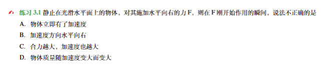
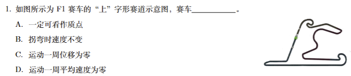
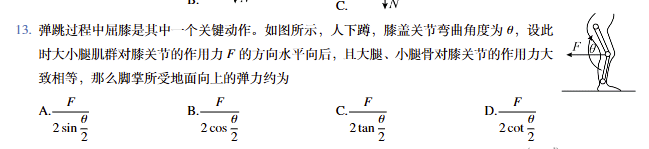

## 1.纯文字类型选择题:

A.效果:



B.代码示例:

```
\begin{exercise}
静止在光滑水平面上的物体，对其施加水平向右的力F，则在F刚开始作用的瞬间，说法不正确的是\\
A．物体立即有了加速度\\
B．加速度方向水平向右\\
C．合力越大，加速度也越大\\
D．物体质量随加速度变大而变大\\

\end{exercise}
```


操作范式:

1.`\begin{exercise}`+`\end{exercise}`

2.换行,复制题干所有文字+`\\`

注: 不要复制题干中的双括号!

3.换行,复制ABCD选项所有文字+`\\`


## 2.文字+一张图片+选项的选择题:

### 2.1 选项比较短,可以放进一行中

A.效果:


B.代码示例:

```
\begin{exercise}
    把一个小球放在玻璃漏斗中，晃动漏斗，可使小球在短时间内沿光滑的漏斗壁在某一水平面内做匀速圆周运动，如图所示。若圆周运动的半径越大，则小球\\
\begin{minipage}{0.25\linewidth}
    A．对漏斗壁的压力越大
\end{minipage}
\begin{minipage}{0.25\linewidth}
    B．加速度越小
\end{minipage}
\begin{minipage}{0.25\linewidth}
    C．角速度越小
\end{minipage}
\begin{minipage}{0.25\linewidth}
    D．线速度越小
\end{minipage}
\begin{figure}[h]
    \hfill
 \includegraphics[width=0.15\linewidth]{fxxk.png}
\end{figure}
\end{exercise}
```

注1: 插入图片时可能产生插到下一页的情况,这里要调整(减小)图片的高度以适应页面.

注2: 

## 2.2 需要把选项放到四行中(每行一个选项)

效果:



代码:

```
\begin{minipage}{0.7\linewidth}
\item 如图所示为 F1 赛车的“上”字形赛道示意图，赛车\underline{\hspace{2cm}}。\\
A．一定可看作质点\\
B．拐弯时速度不变\\
C．运动一周位移为零\\
D．运动一周平均速度为零
\end{minipage}
\begin{minipage}{0.28\linewidth}
    \hfill
   \includegraphics[height=5\baselineskip]{截屏2025-09-21 17.16.13.png}
\end{minipage}
```

注: 

1.如果出现图片跑到文字下方去的情况,那是因为两个minipage之间有空行! 

因此两个minipage之间不要有空行! 


## 3.选项是图片的选择题:


卷子写法:(不知道为什么不能嵌入习题集)

效果:



代码:

```
    \begin{minipage}{0.85\linewidth}
        \item 弹跳过程中屈膝是其中一个关键动作。如图所示，人下蹲，膝盖关节弯曲角度为$\theta$，设此时大小腿肌群对膝关节的作用力$F$的方向水平向后，且大腿、小腿骨对膝关节的作用力大致相等，那么脚掌所受地面向上的弹力约为
    \end{minipage}
    \begin{minipage}{0.15\linewidth}
     \includegraphics[width=\linewidth]{4-2-1.png}
	\end{minipage}\\
	\begin{minipage}{0.24\linewidth}
    A.$\dfrac{F}{2\sin\dfrac{\theta}{2}}$
    \end{minipage}
    \begin{minipage}{0.24\linewidth}
    B.$\dfrac{F}{2\cos\dfrac{\theta}{2}}$
    \end{minipage}
    \begin{minipage}{0.24\linewidth}
    C.$\dfrac{F}{2\tan\dfrac{\theta}{2}}$
    \end{minipage}
    \begin{minipage}{0.24\linewidth}
    D.$\dfrac{F}{2\cot\dfrac{\theta}{2}}$
    \end{minipage}
```

操作:

1.插入题干:

```
    \begin{minipage}{0.85\linewidth}
        \item 弹跳过程中屈膝是其中一个关键动作。如图所示，人下蹲，膝盖关节弯曲角度为$\theta$，设此时大小腿肌群对膝关节的作用力$F$的方向水平向后，且大腿、小腿骨对膝关节的作用力大致相等，那么脚掌所受地面向上的弹力约为
    \end{minipage}
```


2.插入图片:

```
    \begin{minipage}{0.15\linewidth}
     \includegraphics[width=\linewidth]{4-2-1.png}
	\end{minipage}\\
```


3.插入选项:

```
	\begin{minipage}{0.24\linewidth}
    A.$\dfrac{F}{2\sin\dfrac{\theta}{2}}$
    \end{minipage}
    \begin{minipage}{0.24\linewidth}
    B.$\dfrac{F}{2\cos\dfrac{\theta}{2}}$
    \end{minipage}
    \begin{minipage}{0.24\linewidth}
    C.$\dfrac{F}{2\tan\dfrac{\theta}{2}}$
    \end{minipage}
    \begin{minipage}{0.24\linewidth}
    D.$\dfrac{F}{2\cot\dfrac{\theta}{2}}$
    \end{minipage}
```


## 5.左边文字右边图片:

调整图片高度:

```
       \includegraphics[height=6\baselineskip]{pszp-1.png}
```

