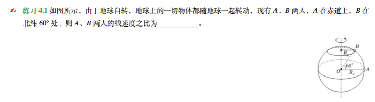

## 1.纯文字类型填空题：


## 2.文字+一张图片的填空题:

A.效果:




B.代码示例:

```
\begin{exercise}
    如图所示，由于地球自转，地球上的一切物体都随地球一起转动，现有$A$、$B$两人，$A$在赤道上，$B$在北纬$60^\circ$处，则$A$、$B$两人的线速度之比为\underline{\hspace{2cm}}。
    \begin{figure}[h]
        \hfill
        \includegraphics[width=0.15\linewidth]{baq.png}
    \end{figure}
\end{exercise}
```


C.操作范式:

1.`\begin{exercise} + \end{exercise}`

2.换行,复制题干所有文字,横线处用`\underline{\hspace{2cm}}`替换.

3.换行,插入图片,设置`[h]`与`width=0.15\linewidth`

如果要调整高度,也可以设置为`height=4\baselineskip`