1)下列关于质点的说法中正确的是（　　）

A.质量很小的物体都能视为质点    

B.体积很小的物体都能视为质点 

C.研究地球的公转时可将地球视为质点  

D.在转动的物体一定不能被视为质点

2)2024年5月28日，历时约8.5小时，神舟十八号载人飞船的航天员刷新了中国航天员单次出舱活动时间纪录，完成了空间站空间碎片防护装置安装、舱外设备巡检等任务。下列说法正确的是（　　）

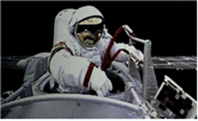

A．执行载人飞船与核心舱交会对接时，可将载人飞船看作质点  

B．研究宇航员出舱太空行走的姿态，可将宇航员看作质点  

C．操作机械臂旋转的工作过程，可将机械臂看作质点  

D．研究载人飞船绕地球一圈的时间，可将载人飞船看作质点

习题:

1)下列关于参照系的说法中，正确的是（　　）

A．被选做参照系的物体一定是相对地面静止的    

B．选不同的参照系时对同一物体的描述是相同的  

C．描述同一物体的运动时可以取不同物体做参照系 

D．描述不同物体的运动不能用同一物体做参照系

2)如图是体育摄影中“追拍法”的成功之作，摄影师眼中清晰的滑板运动员是静止的，而模糊的背景是运动的，摄影师用自己的方式表达了运动的美。请问摄影师选择的参考系是（　　）

A．大地                                  B．太阳   

C．滑板运动员                            D．静止的人

6．关于参考系，下列说法正确的是（　　）

A．太阳从东边升起，从西边落下，选取的参考系是地球    

B．由于运动是绝对的，描述运动时，无需选定参考系  

C．乘客看到车窗外的景物飞速后退，选取的参考系是地面  

D．同一物体的运动，选不同的参考系观察结果肯定是相同的

7．关于物理学中的“静止”，下列说法中正确的是（　　）

A．质点的速度为零即为静止    

B．质点相对于某一参照物始终没有位置的变化即为静止，静止是相对的    

C．质点相对于某一坐标系的加速度为零，即为静止 

D．质点由起点出发，又回到起点即为静止

8．一个小球从距地面4m高处落下，被地面弹回，在距地面1m高处被接住．坐标原点定在抛出点正下方2m处，向下方向为坐标轴的正方向．则小球的抛出点、落地点、接住点的位置坐标分别是（　　）

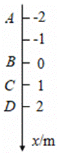

A．2m，﹣2m，﹣1m                     B．﹣2m，2m，1m 

C．4m，0，1m                           D．﹣4m，0，﹣1m

9．下列物理量中不属于矢量的是（　　）

A．加速度           B．时间              C．速度             D．位移

10．下列物理量中，属于标量的是（　　）

A．速度             B．位移              C．功               D．力

11．杭州第19届亚运会开幕式于北京时间2023年9月23日20：00正式开始，主火炬于21时28分点燃，开幕式时长100分钟。根据以上信息，下列说法正确的是（　　）

A．“2023年9月23日20：00”指的是时间   

B．“21时28分”指的是时刻    

C．“开幕式时长100分钟”指的是时刻   

D．以上说法都不对

12．校运动会上，小张同学在400米的比赛中以58秒勇夺第一名，其中“400米”和“58秒”分别表示（　　）

A．位移和时间间隔                       B．路程和时间间隔 

C．位移和时刻                            D．路程和时刻

13．下列描述时间间隔的是（　　）

A．第2秒内         B．1秒末            C．1秒初           D．第3秒初

14．下列说法中，关于时刻和时间间隔，正确的是（　　）

（1）篮球比赛规定，拥有球权的队必须在获得球后的24s内投篮。

（2）比赛还剩最后2min。

（3）商场上午10：00开始营业。

（4）这张照片的曝光时间是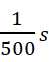。

A．1、2是时刻，3、4是时间间隔   

B．3是时刻，1、2、4是时间间隔   

C．4是时刻、1、2、3是时间间隔   

D．3、4是时刻，1、2是时间间隔

15．如图所示，关于时间轴，下面描述错误的是（　　）

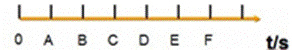

A．BC指的是第2秒                      B．OB指的是前2秒    

C．C点指的是第4秒初                   D．A点指的是第1秒末

16．如图所示的时间轴上标出的是下列哪些时间或时刻（　　）

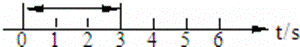

A．第4s初          B．第6s末           C．第3s            D．前3s

17．从学校出发骑行到上海海昌海洋公园的路线如图所示，下列说法正确的是（　　）

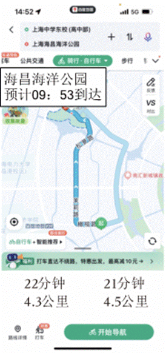

A．图中目的地下方的“预计09：53到达”表示花费时间   

B．图中左下方的“22分钟”表示时刻    

C．图中的4.3km表示从学校到海昌海洋公园的路程 

D．图中的4.3km表示从学校到海昌海洋公园的位移大小

18．描述运动物体位置变化的是（　　）

A．路程                                  B．位移   

C．速度                                  D．速度的变化量

19．如图所示，物体沿边长为x的正方形由A沿箭头所示的方向运动到D，则它的位移和路程分别是（　　）

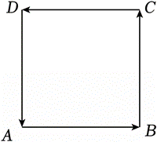

A．0，0                                  B．x向下，3x向下 

C．x向上，3x                            D．0，3x

20．研究物体的速度时，设向东为正。有两个物体，甲的速度是20m/s，方向向东，乙的速度是﹣40m/s，方向向西，则关于它们的速度大小正确的是（　　）

A．甲的大           B．乙的大           C．一样大          D．不能确定

21．下列物理量中，描述汽车运动快慢的是（　　）

A．位移             B．时间              C．路程             D．速度

22．物体的运动状态是指物体的（　　）

A．位置             B．位移              C．速度             D．加速度

23．某同学在操场先向东运动6m，又向北运动8m，总共用时10s，则他在这10s内运动的平均速度大小为（　　）

A．0.5m/s           B．0.8m/s            C．1m/s                       D．1.4m/s

24．智能手机上装载的众多app软件改变着我们的生活．如图所示为百度地图app软件的一张截图，表示了某次导航的具体路径，其推荐路线中有两个数据，10分钟，5.4公里，关于这两个数据，下列说法正确的是（　　）

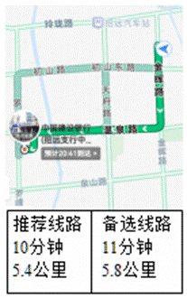

A．研究汽车在导航图中的位置时，可以把汽车看作质点    

B．10分钟表示的是某个时刻    

C．5.4公里表示了此次行程的位移的大小 

D．根据这两个数据，我们可以算出此次行程的平均速度的大小

25．由杭州东站开往上海虹桥站的G7560次高铁列车的时刻表如表所示，已知杭州东站到上海虹桥站的直线距离约为162km，下列说法正确的是（　　）

| 站序 | 车站     | 车次  | 出发时间  到达时间 |
| ---- | -------- | ----- | ------------------ |
| 1    | 杭州东   | G7560 | 15：29  _____      |
| 2    | 嘉兴南   | G7560 | 15：56  15：54     |
| 3    | 上海虹桥 | G7560 | _____  16：24      |

A．15：29是时间间隔  

B．以列车为参考系，坐在车上的乘客在运动  

C．列车全程的平均速率约为81km/h  

D．列车全程的平均速度约为177km/h

26．为了使公路交通有序、安全，路旁立了许多交通标志。如图，甲图是限速标志（白底、红圈、黑字），乙图是路线指示标志。图中的两个数据80km/h和100km分别代表的是（　　）

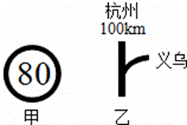

A．平均速度、位移                       B．平均速度、路程 

C．瞬时速度，位移                       D．瞬时速度、路程

27．高速公路“区间测速”的原理是通过测量车辆经过两个监控点之间的时间来判断是否超速。如图所示为某20km路段的区间测速标志，该路段限速120km/h。则（　　）

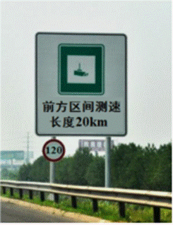

A．“20km”指位移 

B．车辆过此路段瞬时速度为120km/h 

C．车辆过此路段用时15min不属超速    

D．车辆过此路段用时8min不属超速

28．在物理学中，如果要比较不同物体运动的快慢，可以使用速度这个物理量，物体的速度可以用公式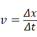来表示，则下列说法正确的是（　　）

A．当Δt取单位时间时，速度和位移的物理意义是相同的   

B．当Δt非常小时，我们把物体在t到t+Δt的时间间隔内的平均速度作为物体在t时刻的瞬时速度

C．无论Δt多大，用该公式直接求出来的就是物体的瞬时速度   

D．瞬时速度与瞬时速率表达的物理意义相同

29．关于速度和速率，下列说法正确的是（　　）

A．平均速度是指物体通过的路程与所用时间的比值    

B．平均速率就是平均速度的大小 

C．瞬时速度，其大小就是瞬时速率，其方向就是物体运动的方向 

D．平均速度的方向就是物体运动的方向，且其与位移的方向总是一致的

30．下面的文字来自一篇报道：“G1次中国标准动车组‘复兴号’驶出北京南站，瞬间提速。15分钟后，激动人心的数字出现在屏幕上：350千米/小时！历经4小时28分钟的飞驰，抵达上海虹桥站。350公里时速的正式运营，标志着我国成为世界高铁商业运营速度最高的国家”。根据报道可知（　　）

A．该列车在前15分钟内的平均速率是350km/h    

B．该列车在前15分钟内行驶的路程是87.5km 

C．屏幕上的数字“350千米/小时”表示列车当时的瞬时速率 

D．列车从北京南站到上海虹桥站行驶的路程为1563km

**2025****年****05****月****17****日物理的高中物理组卷**

**参考答案**

**一．选择题（共****31****小题）**

1．C；  2．C；  3．D；  4．C；  5．C；  6．A；  7．B；  8．B； 9．B；    10．C； 11．B； 12．B； 13．A； 14．B； 15．A； 16．D； 17．C；    18．B； 19．C； 20．B； 21．D； 22．C； 23．C； 24．A； 25．D；    26．D； 27．C； 28．B； 29．C； 30．C； 

