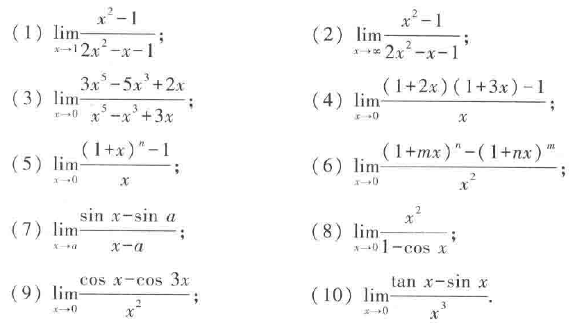

1.生活中,极限的两个例子:

在实际生活中，“极限” 的本质是**一个过程无限趋近某个确定结果**，即使过程永远无法真正抵达，趋势却清晰可见。以下两个生活场景能直观体现这种特性：

A. 杯子里的水蒸发

假设桌上有一杯 100 毫升的水，没有盖子，放在通风处。

- 第 1 天，水分蒸发了 20 毫升，剩下 80 毫升；
- 第 2 天，又蒸发了 16 毫升（假设蒸发速度随水量减少而变慢），剩下 64 毫升；
- 第 3 天，蒸发 12.8 毫升，剩下 51.2 毫升；
- 每天蒸发的水量都是前一天剩余水量的 20%，这个过程会一直持续：水量越来越少，从 100→80→64→51.2→…→0.1→0.01→…

如果我们把经过的天数称作x,把经过x天后杯子里剩下的水称作y,请写出y关于x的函数解析式.

**这里的 “极限” 是 0 毫升**：无论经过多少天，杯子里的水都不会突然变成 “绝对的 0”（总会残留极微量水分子），但水量会无限逼近 0。我们能明确感知到 “水最终会消失” 的趋势，这就是极限的核心 —— 过程的无限性与结果的确定性。

B.切披萨的 “最后一块”

朋友聚会分一张披萨，约定 “每次都把剩下的披萨平均分成 2 份，取其中 1 份”，直到 “分完”。

- 第 1 次：取走 1/2，剩下 1/2；
- 第 2 次：从剩下的 1/2 中取走 1/2（即整个披萨的 1/4），剩下 1/4；
- 第 3 次：取走 1/8，剩下 1/8；
- ……
  每次取走的都是前一次剩余量的 1/2，剩下的量依次是 1/2、1/4、1/8、1/16…

如果我们把切的次数记为x,把剩下的披萨百分比记为y,请写出y关于x的函数解析式.

**这里的 “极限” 是 “取完整个披萨”**：理论上，无论取多少次，都总会剩下一小块（1/2ⁿ），永远无法 “绝对取完”；

但实际中，当剩下的量小于一口的大小时，我们会认为 “已经取完了”。这个过程中，“取走的总量” 无限逼近整个披萨的大小，体现了极限 

“无限趋近目标” 的特性。

这两个例子的共性在于：**过程可以无限延续，但结果的趋势是确定的**。生活中类似的场景还有很多,它们都在悄悄展现着极限的数学逻辑。

2.来看函数的极限:

重新定义函数: 在我们接下来要讨论的函数,只接收一个输入和一个输出,不像写程序代码中的那样具有较为灵活的多变性.事实上,这是数学

家保护我们的一种手段.等上了大学,你会学到所谓的"多元函数",也就是可能有多个输入和输出的函数,被称为多元函数.

所谓函数的极限,是当x充分接近某个量的时候,y所趋向的值.(y可以距离y0足够近)

比如水杯中的水,当x接近正无穷大时,(当x很大很大时),y就趋向于0.

切披萨也是如此.

3.当然,在数学上,我们可以把极限这个概念抽象出来,来试着做一些特殊的题目.

例1: y=x+1,在x趋向于0的时候,y会趋向于多少?

例2: y=4/x,当x趋向于0的时候,y会趋向于多少? 为什么?

如果不清楚,可以靠画图得出(数形结合的威力).

4.下面给出极限的定义.

注意,在极限的定义中,x不会与x~0~相等!

5.使用极限的定义,我们可以证明3中的例1和例2.

所谓极限的感性认识,就是当x距离x~0~足够近时,y也能距离y~0~足够近.

注,x并不会碰到x~0~!

注: 极限存在不代表函数在这个点有定义!

6.找时间出一些极限的习题,谢谢.

# 例题: 计算某些经典的极限.

第五题: 二项式定理.

通过这些题目,更好地体会极限是一个"趋势"的理解.

前四题要做出来.

第五题要会做.
