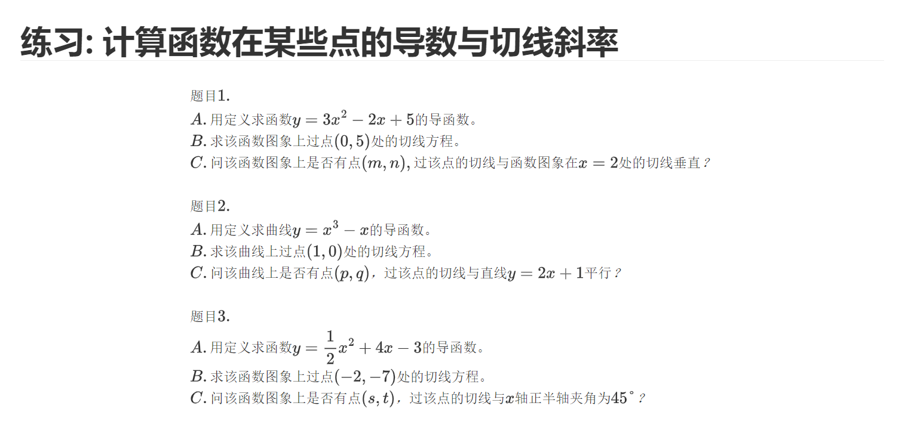

1.导数是一个沟通代数和几何的桥梁:

从代数上来说,导数可以用计算得出.

从几何上来说,导数指的就是某个函数在某一点的切线斜率.

**基本求导公式**：如常数函数、幂函数、三角函数等的求导公式。

2.因此,让我们来求一些基本函数的导数:

常数函数:

幂函数: x^a^

三角函数: sinx,cosx.

3.导数的四则运算法则:

只学会加法就够了.(减法自可推导)

4.让我们来看一下周末习题:

