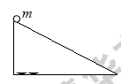
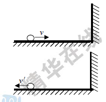
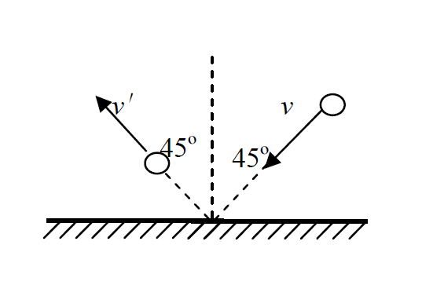
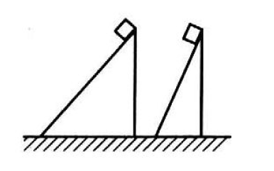
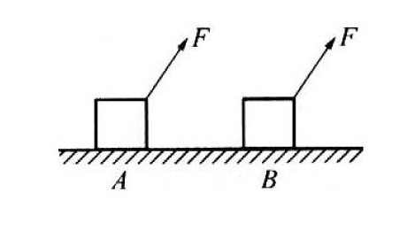
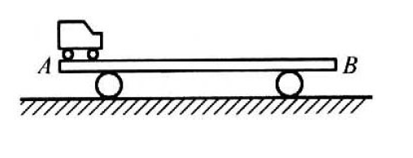
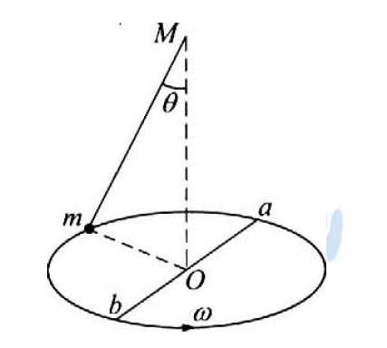

# 一、动量和冲量

1.动量: 为矢量, **p=mv**, 与物体移动的速度方向相同.

动量是描述物体运动的一个状态量,其与时刻相对应. 在不同的时刻,物体会拥有不同的动量.

2.冲量: 按定义,力和力的作用时间的乘积叫做冲量: **I=Ft**, 依然为矢量.

(1).冲量是描述力的时间累计效应的物理量,是过程量,其与时间相对应.

(2).冲量是矢量,其方向由力的方向所决定(累积的冲量不一定和力的方向相同).

如果力的方向在作用时间内保持不变,那么冲量的方向就和力的方向相同.

(3). 高中阶段只要求用I=Ft计算**恒力**的冲量。对于变力的冲量,只能利用动量定理通过物体动量的变化来求。

(4). 冲量与功的区别:

功需要距离：只要物体没有在力的方向上移动距离,即使有力也不会做功。

冲量只需要时间：在一段时间内，恒力一定会累积冲量。

## 例题分析

例1.质量为m的小球由高为H的光滑斜面顶端无初速滑到底端的过程中，重力、弹力、合力的冲量各是多大？

例2.一个质量为1kg的钢球,以1m/s的速度水平向右运动,碰到墙面后被弹回,以1m/s的速度水平向左运动.求动量的变化量.

例3：一个质量是0.2kg的钢球，以2m/s的速度斜射到坚硬的大理石板上，入射的角度是45°，碰撞后被斜着弹出，弹出的角度也是45°，速度大小仍为2m/s，用作图法求出钢球动量变化大小和方向？

# 动量和冲量习题讲练

1.下列关于动量的论述中正确的是: （      ）

A.质量大的物体动量一定大  			  					B.速度大的物体动量一定大

C.两物体动能相等，质量大的动量大 				   D.两物体动能相等，动量一定相等

2.关于物体的动量和动能，下列说法中正确的是:  （      ）

A.一物体的动量不变，其动能一定不变

B.一物体的动能不变，其动量一定不变 

C.两物体的动量相等，其动能一定相等 

D.两物体的动能相等，其动量一定相等

3.两个具有相等动量的物体A,B.质量分别为m~A~和m~B~,且m~A~>m~B~.比较它们的动能,则: （      ）

A. A的动能较大 B. B的动能较大 C. 动能相等 D. 不确定

4.水平桌面上的物体质量为m,用水平推力F推它,作用时间为t,物体始终不动. 在t时间内,推力对物体的冲量为<u>&nbsp;&nbsp;&nbsp;&nbsp;&nbsp;&nbsp;&nbsp;&nbsp;&nbsp;&nbsp;</u>

5.甲、乙两物体的质量之比为m~甲~: m~乙~=1:4.若它们的动能相等,则动量大小之比p~甲~: p~乙~是（     ）

A.1:1 B.1:2 C.1:4 D.2:1

6.(多选)如图所示，两个质量相等的物体在同一高度沿倾角不同的两个光滑斜面由

静止自由滑下，到达斜面底端的过程中，两个物体具有的相同的物理量是 ()

A.重力的冲量 B.弹力的冲量 C.合力的冲量 D.刚达到底端时的动量 E.刚达到底端时动量的水平分量

7.质量为 2kg 的物体作竖直上抛运动,4s后回到出发点.不计空气阻力,在此过程物体动量的改变量和所受的冲量分别为（    ） (g 取 10m/s^2^)

A.80kg$\cdot$m/s 和 80N$\cdot$s，方向均为竖直向下 

B.80kg$\cdot$m/s，方向竖直向上和80N$\cdot$s，方向竖直向下 

C.40kg$\cdot$m/s 和 40N$\cdot$s，方向均为竖直向下 

D.80kg$\cdot$m/s 和 40N$\cdot$s，方向均为竖直向下

8.质量不等的两个物体静止在光滑的水平面上.两物体在外力作用下获得相同的动能.则下列说法中正确的是（    ）

A.质量大的物体动量变化小 B.质量大的物体受到的冲量大 

C.质量大的物体末动量小 D.质量大的物体动量变化率一定大

9.以初速度 v~0~=40m/s竖直向上抛出的物体,其质量为 4kg. 

则其第 2 秒末的动量为<u>&nbsp;&nbsp;&nbsp;&nbsp;&nbsp;&nbsp;&nbsp;&nbsp;&nbsp;&nbsp;</u>kg$\cdot$m/s，第 5 秒末动量为<u>&nbsp;&nbsp;&nbsp;&nbsp;&nbsp;&nbsp;&nbsp;&nbsp;&nbsp;&nbsp;</u>kg$\cdot$m/s.

从第 2 秒末到第 5 秒末动量的变化量为<u>&nbsp;&nbsp;&nbsp;&nbsp;&nbsp;&nbsp;&nbsp;&nbsp;&nbsp;&nbsp;</u> kg$\cdot$m/s.(g 取 10m/s^2^).

10.从水平地面上方同一高度处，使 a 球竖直上抛，使 b 球平抛，且两球质量相等，初速度大小相同，最后落于同一水平地面上(空气阻力不计).则下列说法中正确的是（    ）

A.两球着地时的动量相同 B.两球着地时的动能相同 C.重力对两球的冲量相同 D.重力对两球所做的功相同

11.要计算竖直上抛一个物体的过程中手对抛出物作用力的冲量.如不计空气阻力,所需的已知条件为下列几种组合中的（    ）.
A.物体的质量 m,它能上升的最大高度 H  B.抛出时的初速 v~0~,它能上升的最大高度 H

C.抛出时用力 F 的大小，物体上升到最高处所需的时间 t D.物体的重力 G,它上升的时间t'

12.用绳子拴一个质量是0.1kg 的小球，由静止开始以2m/s^2^的加速度竖直向上运动.

头3s内绳子拉力对物体的冲量的大小为<u>&nbsp;&nbsp;&nbsp;&nbsp;&nbsp;&nbsp;&nbsp;&nbsp;&nbsp;&nbsp;</u>N·s. 

头3s内物体动量变化的大小为<u>&nbsp;&nbsp;&nbsp;&nbsp;&nbsp;&nbsp;&nbsp;&nbsp;&nbsp;&nbsp;</u>kg$\cdot$m／s（g 值取10m/s^2^)

13.质量为 0.4kg 的小球以10m/s的速度从5m高的平台边缘水平抛出,小球落地时动量的大小是<u>&nbsp;&nbsp;&nbsp;&nbsp;&nbsp;&nbsp;&nbsp;&nbsp;&nbsp;&nbsp;</u> kg$\cdot$m／s，方向是<u>&nbsp;&nbsp;&nbsp;&nbsp;&nbsp;&nbsp;&nbsp;&nbsp;&nbsp;&nbsp;</u>，小球运动全过程中动量的变化是<u>&nbsp;&nbsp;&nbsp;&nbsp;&nbsp;</u><u>&nbsp;&nbsp;&nbsp;&nbsp;&nbsp;</u> kg$\cdot$m／s (g 取10m/s^2^).

14.如果某物体作匀速圆周运动的动量大小为p.经过一段时间后其速度方向改变了θ角，则动量变化的大小为<u>&nbsp;&nbsp;&nbsp;&nbsp;&nbsp;&nbsp;&nbsp;&nbsp;&nbsp;&nbsp;</u>.

15.甲、乙两物体质量相等,并排静止在光滑的水平面上. 现用一水平恒力 F 推动甲物体,同时在与 F 力相同方向上给物体乙一个瞬间冲量I,使两物体开始运动.当两物体重新相遇时，经历的时间 t=<u>&nbsp;&nbsp;&nbsp;&nbsp;&nbsp;&nbsp;&nbsp;&nbsp;&nbsp;&nbsp;</u>

16.质量为 1.5kg 的物体，以 4m/s 的初速度竖直上抛，不计空气阻力.求物体抛出时和落回抛出点时的动量,及这段时间内动量的变化量和重力的冲量.（g 取 10m/s^2^）.

17.以初速度 v~0~=10m/s 水平抛出一个质量为1kg 的物体，若在抛出 3s 后它未与地面及其它物体相碰.

求它在3s内重力的冲量，3s 内物体动量的变化量，第 3 秒末的动量（g 取 10m/s^2^）.

18.如图所示，物体质量 m=2kg，放在光滑水平桌面上，在恒定的牵引力 F 作用下由位置 A 运动到位置 B，速度由 

2m/s 增加到 4m/s，力 F 与水平面成 60°角.求在此过程中力 F 的冲量.

19．一个质量为 m 的小球，从高度为 H 的地方自由落下，与水平地面碰撞后向上弹起，设碰撞时间为定值 t，则在碰撞过程中. 下列关于小球对地面的平均冲击力与球弹起的高度 h 的关系中正确的是（设冲击力远大于重力）: （    ）

A. h 越大，平均冲击力越大

B. h 越小，平均冲击力越大 

C.平均冲击力大小与 h 无关

D.若h一定，平均冲击力与小球质量成正比

20.如图所示，质量为4kg的平板车静止在光滑水平面上，一质量为 1kg 的玩具小车在 1s 内由静止从车的左端 A 点

加速运动到车的右端 B 点，AB 间距 0.2m，在这段时间内小车对平板车的水平冲量大小为多少?

21.如图所示，绳子一端固定于 M 点，另一端系一质量为 m 的质点以角速度$\omega$绕竖直轴作匀速圆周运动，绳子与竖

直轴之间的夹角为$\theta$。已知 a、b 为直径上的两点，求质点从 a 点运动到 b 点绳子张力的冲量的大小.

注: 使用水平方向上的动量变化量与竖直方向上的重力冲量解题.

思考: 为什么不能直接用I=F*t,计算张力乘以时间?

答案: 张力方向始终在变!不是恒力.