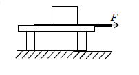
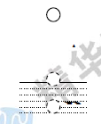
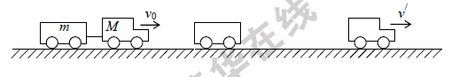
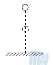
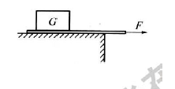
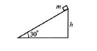

# 二、动量定理

## 要求

掌握动量定理及其应用

## 知识要点

1.动量定理: 一定过程中,物体所受的合外力的冲量累积=物体的动量变化量.即
$$
\Sigma I_合 = \Delta p
$$
(1).合外力的冲量是物体动量发生变化的根本原因.

(2).动量定理给出了冲量(过程量)和动量变化(状态量)之间的互求关系.

(3).动量定理的表达式为矢量式.在一维的情况下,必须以同一个规定的方向为正.

2.利用动量定理进行定量计算:

利用动量定理解题,必须按照以下几个步骤进行:

(1).明确研究对象和研究过程.

研究对象: 可以是一个物体,也可以是几个物体组成的质点组.

质点组内的各个物体可以是相对静止的,也可以是相对运动的.(见例5).

研究过程既可以是全过程,也可以是全过程的某个阶段.

(2).进行受力分析.只分析研究对象以外的物体施给研究对象的力。所有外力之和为合外力。研究对象内部的相互作用力（内力）会改变系统内某一物体的动量，但不改变系统的总动量，因此不必分析内力。

如果在所选定的研究过程中的不同阶段中物体的受力情况不同，就要分别计算它们的冲量，然后求它们的矢量和。

(3).规定正方向.由于力、冲量、速度、动量都是矢量,列式计算前一定要规定一个正方向.与该方向相同的矢量为正,反之为负.

(4).写出研究对象的初、末动量和合外力的冲量。

(5).根据动量定理列式求解.

## 例题分析

例1：以初速度 v~0~平抛出一个质量为 m 的物体，抛出后 t 秒内物体的动量变化是多少?

例 2：鸡蛋从同一高度自由下落，第一次落在地板上，鸡蛋被打破；第二次落在泡沫塑料垫上，没有被打破。这是为什么?

例 3：某同学要把压在木块下的纸抽出来。第一次他将纸迅速抽出，木块几乎不动：第二次他将纸较慢地抽出，木块反而被拉动了。这是为什么？

例 4:质量为 m 的小球，从沙坑上方自由下落，经过时间 t 到达沙坑表面，又经过时间 t 停在沙坑里。
求:(1) 沙对小球的平均阻力 F: (2) 小球在沙坑里下落过程所受的总冲量 I。

例 5：质量为 M 的汽车带着质量为 m 的拖车在平直公路上以加速度 a 匀加速前进，当速度为 v~0~时拖车突然与汽车脱钩，到拖车停下瞬间司机才发现。若汽车的牵引力一直未变，车与路面的动摩擦因数为μ，那么拖车刚停下时，汽车的瞬时速度是多大？

例 6：质量为 m=1kg 的小球由高 h~1~=0.45m 处自由下落，落到水平地面后，反跳的最大高度为 h~2~=0.2m，从小球下落到反跳到最高点经历的时间为$\Delta$t=0.6s，取 g=10m/s^2^。求：小球撞击地面过程中，球对地面的平均压力的大小F。

## 习题讲练

1.在一条直线上运动的物体，其初动量为 8kg$\cdot$m/s，它在第1秒内受到的冲量为3N$\cdot$s，第 2 秒内受到的冲量为 

5N$\cdot$s.则它在第 2 秒末的动量为 (    )

A. 10kg$\cdot$m/s B. 11kg$\cdot$m/s C. 13kg$\cdot$m/s D. 16kg$\cdot$m/s

2.某物体在运动过程中，受到的冲量为-1N$\cdot$s，则 (    )

A. 物体原动量方向一定与这个冲量方向相反

B. 物体的末动量一定是负值 

C. 物体的动量一定要减少

D.物体动量的增量一定与所规定的正方向相反

3.人从高处跳到低处时，为了安全，一般都让脚尖先着地，这样做是为了 (    )

A.减小冲量

B.减小动量的变化量

C.增大与地面的作用时间，从而减小冲力 

D.增大人对地面的压强，起到安全作用

4.物体在恒定合外力作用下运动，则 (    ) 

A.物体一定作直线运动 

B.物体的动量变化率一定恒定 

C.物体的动量增量与时间成正比

D.单位时间内物体动量的增量与物体的质量无关

5.玻璃杯从同一高度落下，掉在石头上比掉在草地上容易碎，这是由于玻璃杯在与石头的撞击过程中 (    )

A.玻璃杯的动量较大 

B.玻璃杯受到的冲量较大 

C.玻璃杯的动量变化较大

D.玻璃杯的动量变化较快

6.质量为 1.0kg 的小球从 20m 处自由下落到软垫上，弹后上升的最大高度为 5.0m，小球与软垫接触的时间为

1.0s，接触时间内小球受到合力的冲量大小为 (空气阻力不计，g 取 10m/s^2^)  (    )

A. 10N·s

B. 20N$\cdot$s 

C. 30N$\cdot$s 

D. 40N·s

7.以 15m/s 的速度平抛一个小球，小球的质量为 1kg， 经 2s 小球落地，不计空气阻力，g 取 10m/s.

小球落地时的速度大小为<u>&nbsp;&nbsp;&nbsp;&nbsp;&nbsp;&nbsp;&nbsp;&nbsp;&nbsp;&nbsp;</u>m/s.在这一过程中，小球的动量变化的大小为 <u>&nbsp;&nbsp;&nbsp;&nbsp;&nbsp;&nbsp;&nbsp;&nbsp;&nbsp;&nbsp;</u>kg$\cdot$m/s.

8.小球的质量为2m,以速度v沿水平方向垂直撞击墙壁,球被反方向弹回速度大小是$\frac{4}{5}v$,球与墙撞击时间为t,那么在撞击过程中,球对墙的平均冲力大小是（    ）

A.$\frac{2mv}{5t}$ 	B.$\frac{8mv}{5t}$ 	C.$\frac{18mv}{5t}$  D.$\frac{2mv}{t}$

9.质量为 m 的物体，以初速度 v~0~ 竖直上抛，然后又回到原抛出点. 若不计空气阻力，物体所受的总冲量和平均冲力分别是 (以竖直向上方正方向) (    )

A.-mv~0~,$\frac{1}{2}$mg B.-2mv~0~,-mg C.-2mv~0~,mg D.2mv~0~,-mg

10.如图所示，把重物 G 压在纸带上，若用一水平力迅速拉动纸带，纸带将会从重物下抽出；若缓慢拉动纸带，

纸带也从重物下抽出，但重物跟着纸带一起运动一段距离.下列解释上述现象的说法中正确的是（）

A.在缓慢拉动纸带时，纸带给重物的摩擦力大

B.在迅速拉动纸带时，纸带给重物的摩擦力小 

C.在缓慢拉动纸带时，纸带给重物的冲量大 

D.在迅速拉动纸带时，纸带给重物的冲量小

11.竖直上抛某物体，物体达到最高点后又回到抛出点，设物体所受空气阻力大小不变，则（    )

A.上升过程中重力的冲量比下落过程中重力的冲量小 

B.全过程中物体的动量增量方向向下 

C.空气阻力的冲量值上升与下落过程相等

D.空气阻力在全过程中的合冲量方向向上

12.水力采煤是利用高速水流冲击煤层而进行的.假如煤层受到 3.6×10N/m^2^的压强冲击即可被破碎，若高速水流沿

水平方向冲击煤层，不考虑水的反向溅射作用，则冲击煤层的水流速度至少应为 (    ) 

A.30m/s B.40m/s C.45m/s D.60m/s

13.一质量为 100g 的小球从 0.80m 高处自由下落到一厚软垫上.若以小球接触软垫到小球陷到最低点经历了 

0.20s，则这段时间内软垫对小球的冲量为<u>&nbsp;&nbsp;&nbsp;&nbsp;&nbsp;&nbsp;&nbsp;&nbsp;&nbsp;&nbsp;</u>N$\cdot$s (g取10m/s^2^， 不计空气阻力).

14.跳伞员从飞机上跳下，经过一段时间速度增大到收尾速度 50m/s 时才张开伞，这时，跳伞员受到很大的冲力。

设张伞时间经1.5s，伞开后跳伞员速度为 5m/s，速度方向始终竖直向下，则冲力为体重的<u>&nbsp;&nbsp;&nbsp;&nbsp;&nbsp;&nbsp;&nbsp;&nbsp;&nbsp;&nbsp;</u>倍.

15.质量为 50g 的机枪子弹的出膛速度为 1000m/s，假设机枪每分钟发射 120 发子弹，则在射击时机枪手需用多

大的力抵住机枪?

16.质量为0.2kg 的球，从 5.0m 高处自由下落到水平钢板上又被竖直弹起，弹起后能达到的最大高度为 

4.05m，如果球从开始下落到弹起达到最大高度所用时间为 1.95s，不考虑空气阻力 (g 取10m/s^2^)

求小球对钢板的作用力。

17.两个质量不同的物体，以相同的初动量开始沿同一水平面滑动，设它们与水平面间的动摩擦因数相同，则它们

滑行的距离大小关系是 (    )

A.质量大的物体滑行距离较大 

B.质量小的物体滑行距离较大 

C.两物体滑行距离一样大 

D.条件不足，无法比较

18.一粒钢珠从静止状态开始自由下落，然后陷入泥潭中(不计摩擦力)。若把在空中下落的过程称为过程 I，进入泥潭直到停住的过程称为过程Ⅱ，则 (    ）（1995 年全国高考试题）

A.过程I中钢珠动量的改变量等于重力的冲量

B.过程Ⅱ中阻力的冲量的大小等于过程 I 中重力冲量的大小

C.过程Ⅱ中钢珠克服阻力所做的功等于过程 I 与过程Ⅱ中钢珠所减少的重力势能之和

D.过程Ⅱ中损失的机械能等于过程I中增加的动能.

19.枪筒长为 L,子弹质量为 m,设子弹被击发后在枪筒内作匀加速直线运动，运动的时间为 t,则 (    ) 

A.子弹离开枪口时的动能为$\frac{mL^2}{2t^2}$

B.子弹在枪筒内运动过程中外力的冲量为$\frac{mL^2}{t^2}$

C.子弹在枪筒内运动过程中，合外力对它做的功是$\frac{2mL^2}{t^2}$

D.子弹受到的平均冲力是$\frac{2mL^2}{t^2}$

20.在光滑的水平面上，质量为M的平板小车以速度 v~0~ 作匀速直线运动。质量为 m 的物体竖直掉在车上。由于物体和车之间的摩擦，经时间 t 后它们以共同的速度前进。在这个过程中，小车所受摩擦力的大小为<u>&nbsp;&nbsp;&nbsp;&nbsp;&nbsp;&nbsp;&nbsp;&nbsp;&nbsp;&nbsp;</u>

注: 尝试用两种方法做.

21.以 2m/s 的速度作水平匀速运动的质量为 0.1kg 的物体，从某一时刻起受到一个始终与速度方向垂直、大小为 

2N 的力的作用，在作用 0.1π(s) 后，物体的速度大小是<u>&nbsp;&nbsp;&nbsp;&nbsp;&nbsp;&nbsp;&nbsp;&nbsp;&nbsp;&nbsp;</u> m/s,这 0.1π(s) 内，力对物体的冲量大小为 <u>&nbsp;&nbsp;&nbsp;&nbsp;&nbsp;&nbsp;&nbsp;&nbsp;&nbsp;&nbsp;</u>N$\cdot$

s.

22.有一质量为 50g 的小球，以10m／s的速度垂直射到竖直的墙壁上又被垂直墙壁反弹，落到离墙 5m 远的水平

地面上。若已知小球击墙点离地高 5m，球与墙作用时间为 0.05s，求小球与墙撞时墙对球的平均作用力.

23.光滑斜面高 h=0.8m,质量 m=1kg 的滑块从固定的斜面顶端由静止释放，如图所示.滑块滑到底端的过程中（g 

取10m/s^2^):

(1) 力对滑块所做的功为<u>&nbsp;&nbsp;&nbsp;&nbsp;&nbsp;&nbsp;&nbsp;&nbsp;&nbsp;&nbsp;</u>

(2) 滑块的动能增量为<u>&nbsp;&nbsp;&nbsp;&nbsp;&nbsp;&nbsp;&nbsp;&nbsp;&nbsp;&nbsp;</u>

(3) 重力对滑块的冲量为<u>&nbsp;&nbsp;&nbsp;&nbsp;&nbsp;&nbsp;&nbsp;&nbsp;&nbsp;&nbsp;</u>N$\cdot$s.

(4) 滑块的动量增量为<u>&nbsp;&nbsp;&nbsp;&nbsp;&nbsp;&nbsp;&nbsp;&nbsp;&nbsp;&nbsp;</u> kg$\cdot$m/s.

